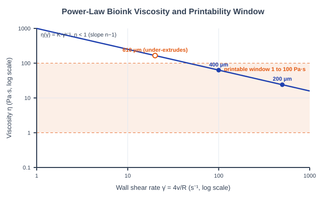
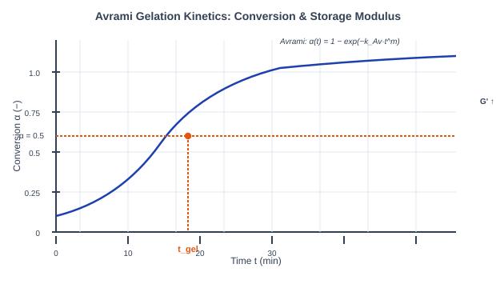
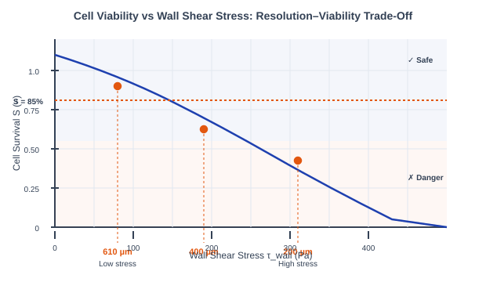
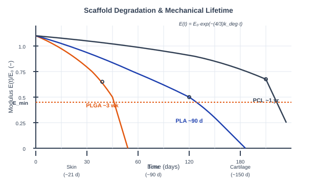
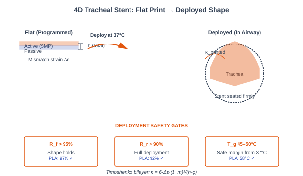

# Theory: 4D Bioprinting

## 1. Introduction to 4D Bioprinting
Bioprinting is the additive deposition of living cells suspended in a hydrogel "bioink" to build tissue-like constructs layer by layer. It becomes *4D* bioprinting when the printed object is designed to change shape or function over time — a flat sheet that curls into a tube, a scaffold that dissolves on a schedule, a construct that matures as its cells remodel it. The extra dimension is time, and getting there means clearing five very different hurdles in sequence: the ink has to extrude, it has to set, the cells have to live, the scaffold has to last exactly long enough, and — in the capstone — the whole thing has to fold itself into a working device. Each sub-calculator below is one of those hurdles.

---

## 2. The Extrusion Bioprinting Chain
Extrusion bioprinting pushes bioink through a fine nozzle under pressure. Four physics problems are coupled at the nozzle tip and they pull against each other:
1. **Rheology** sets whether the ink flows cleanly (Sub-Calc A).
2. **Gelation kinetics** sets whether the deposited layer holds before the next lands (Sub-Calc B).
3. **Shear stress** in the nozzle sets how many cells survive the trip (Sub-Calc C).
4. **Degradation** sets how long the finished scaffold bears load (Sub-Calc D).

The tension is real: a narrow nozzle prints fine features but raises shear and kills cells; a fast-gelling ink resists slumping but can clog. The capstone (Sub-Calc E) shows what these constraints buy you — a device that deploys itself.

---

## 3. Bioink Viscosity & the Printability Window (Sub-Calc A)
A good bioink is **shear-thinning**: thick at rest so a printed road holds its shape, thin under the nozzle so it extrudes without crushing the cells inside. The viscosity follows the **power-law (Ostwald&ndash;de Waele) model**:

&eta;(&gamma;&#775;) = K &middot; &gamma;&#775;(n&minus;1)

Where:
* K is the consistency index (Pa&middot;s&#8319;) — the overall thickness.
* n is the flow index. For n &lt; 1 the ink is shear-thinning; on a log&ndash;log plot &eta; vs &gamma;&#775; is a straight line of slope (n&minus;1).
* The wall shear rate at the nozzle, for a Newtonian reference, is &gamma;&#775; = 4Q/(&pi;R&sup3;) = 4v/R, so a narrower tip or faster print drives &gamma;&#775; up.

Printability is a window, not a point: the ink is judged printable when its wall viscosity satisfies **1 Pa&middot;s &le; &eta;(&gamma;&#775;print) &le; 100 Pa&middot;s**. Below 1 it spreads into a puddle; above 100 it under-extrudes and tears. After extrusion the ink rebuilds its structure (thixotropy) as &eta;(t) = &eta;0(1 &minus; e&minus;t/&tau;), reaching 90% recovery at t90 = &tau;&middot;ln(10).

<em>Figure 1: The shear-thinning power law is a straight line of slope n&minus;1 on log&ndash;log axes; each nozzle sits at its own wall shear rate, and only those landing inside the 1&ndash;100 Pa&middot;s band print cleanly (Sub-Calc A).</em>

---

## 4. Thermal Gelation Kinetics (Sub-Calc B)
A freshly printed layer is still liquid — it must gel fast enough to carry the next layer before it slumps. Isothermal gelation is modeled with **Avrami kinetics**, borrowed from crystallization theory:

&alpha;(t) = 1 &minus; exp(&minus;kAv &middot; tm)

Here &alpha; is the fraction converted from sol to gel, m is the Avrami exponent (nucleation/growth dimensionality, 1&ndash;4), and kAv is the rate constant. The **gel point** is taken at &alpha; = &frac12;, which inverts to a closed form:

tgel = (ln2 / kAv)1/m

The storage modulus tracks conversion directly, G&prime;(t) = G&prime;&infin; &middot; &alpha;(t), building sigmoidally toward the plateau G&prime;&infin;. The rate constant carries the temperature dependence through an **Arrhenius law**, kAv(T) = kAv(Tref)&middot;exp[&minus;(Ea/R)(1/T &minus; 1/Tref)], with Ea &asymp; 62 kJ/mol and the model anchored to collagen so that tgel(37 &deg;C) &asymp; 18 min at m = 2.

<em>Figure 2: Gel conversion rises sigmoidally; the gel point (&alpha; = &frac12;) fixes tgel, and the storage modulus G&prime; climbs on the same curve toward its plateau G&prime;&infin; (Sub-Calc B).</em>

---

## 5. Cell Viability Through Print Shear (Sub-Calc C)
Extrusion forces living cells through the nozzle, where the fluid drags on the wall. The **wall shear stress** is the viscosity times the wall shear rate:

&tau;wall = 4&eta;Q/(&pi;R&sup3;) = &eta; &middot; (4v/R)

It climbs steeply as the nozzle narrows (R in the denominator). Cell survival falls off as a **first-order shear-kill process** over the residence time the cells spend in the nozzle:

S = exp(&minus;kkill &middot; &tau;wall &middot; tres), &nbsp;&nbsp; tres = Lnozzle / vprint

kkill &asymp; 0.01 Pa&#8315;&sup1;s&#8315;&sup1; lumps the cell type and shear mode into one screening coefficient; the target is survival S &gt; 85%. This is the **resolution&ndash;viability trade-off** unique to bioprinting: the 200 µm tip prints the finest features but drives &tau;wall highest, while the 610 µm tip is gentle but coarse. The model is a &plusmn;20% screen — a real build must still be confirmed with LIVE/DEAD staining.

<em>Figure 3: Survival decays exponentially with wall shear stress; the fine 200 µm nozzle sits deepest in the danger zone while the coarse 610 µm tip stays above the 85% target — the resolution&ndash;viability trade-off (Sub-Calc C).</em>

---

## 6. Scaffold Degradation & Mechanical Lifetime (Sub-Calc D)
A tissue scaffold is meant to disappear: too fast and it fails before the tissue can carry load, too slow and it blocks regeneration. Hydrolysis of the ester backbone removes mass as a **first-order decay**:

M(t) = M0 &middot; exp(&minus;kdeg &middot; t)

Stiffness, though, falls *faster* than mass. A porous strut network follows the Gibson&ndash;Ashby style scaling E &prop; M4/3, so:

E(t) = E0 &middot; (M/M0)4/3 = E0 &middot; exp(&minus;(4/3) kdeg &middot; t)

Halving the remaining mass cuts modulus by 24/3 = 2.52&times;. Mechanical failure is the moment stiffness drops through the tissue's load-bearing floor Emin:

tfail = ln(E0/Emin) / ((4/3) kdeg)

The three model polymers span three timescales: PLGA (kdeg = 0.02/day, weeks), PLA (0.002/day, months), and PCL (0.0005/day, years). Note E0 here is the *porous* scaffold modulus (MPa-scale), not the bulk polymer (GPa). Matching tfail to a tissue's regeneration time (skin ~21 d, bone ~90 d, cartilage ~150 d) is the design goal.

<em>Figure 4: Because E &prop; M4/3, stiffness decays faster than mass; PLGA, PLA and PCL cross the Emin load-bearing floor at weeks, months and years respectively (Sub-Calc D).</em>

---

## 7. The 4D Self-Deploying Tracheal Stent (Sub-Calc E)
The capstone folds a flat-printed bilayer into a tracheal stent at body temperature, integrating the shape-memory polymer of Experiment 1 with the Timoshenko bilayer of Experiment 2. The target curvature is set by the airway, and the print deliberately over-curves by 20% so the relaxed device seats firmly:

&kappa;target = 1/Rtube, &nbsp;&nbsp; &kappa;printed = 1.2 &middot; &kappa;target

An active layer that wants to contract by a mismatch strain &Delta;&epsilon; against a passive layer bends the stack. The **Timoshenko bimetal curvature** for layer thickness ratio m = h1/h2 and modulus ratio n = E1/E2 is:

&kappa; = 6 &middot; &Delta;&epsilon; &middot; (1+m)&sup2; / (h &middot; &phi;), &nbsp;&nbsp; &phi; = 3(1+m)&sup2; + (1+mn)(m&sup2; + 1/(mn))

Setting &kappa; = &kappa;printed and solving for the total thickness back-calculates the bilayer you must print:

h = 6 &middot; &Delta;&epsilon; &middot; (1+m)&sup2; / (&kappa;printed &middot; &phi;)

Geometry alone is not enough — the SMP must clear three **deployment safety gates**: shape fixity Rf &gt; 95%, shape recovery Rr &gt; 90%, and a glass transition Tg = 45&ndash;50 &deg;C. That Tg window is the subtle one: a PCL-SMP at Tg = 35 &deg;C is only 2 &deg;C below body temperature, so the stent could deploy prematurely during room-temperature handling. The PLA-SMP (Tg 58 &deg;C, Rf 97%, Rr 92%) clears every gate.

<em>Figure 5: A flat bilayer programmed with mismatch strain &Delta;&epsilon; curls to &kappa;printed = 1.2&kappa;target and seats inside the airway, provided the SMP passes the Rf, Rr and Tg deployment gates (Sub-Calc E).</em>

