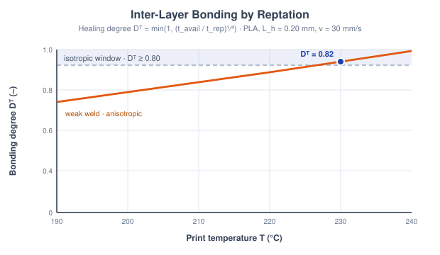
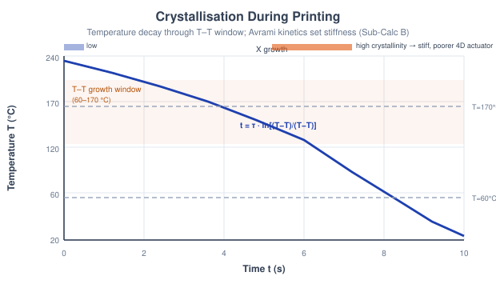
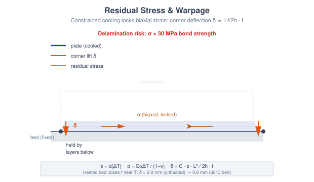
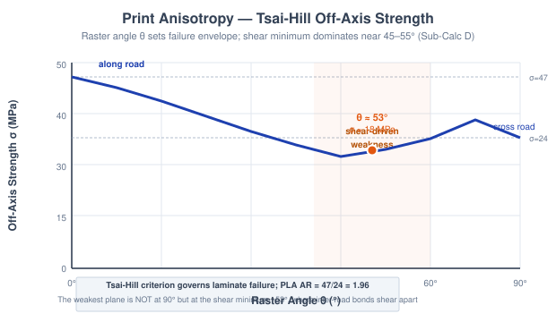
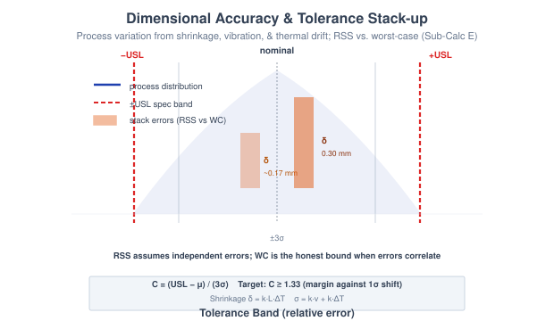

# Theory: 4D Print Process Engineering

## 1. Introduction to the 4D Print Process
A 4D print only folds, curls, or actuates the way it was designed to if the underlying fused-deposition process laid the material down soundly. Every road is extruded hot, welds to its neighbour, cools, contracts, and crystallises, and each of those steps can quietly ruin the part before the stimulus is ever applied. This experiment treats the print process itself as the object of study: five sub-calculators, each isolating one mechanism that decides whether the finished geometry is strong, dimensionally true, and free to transform.

---

## 2. Why Process Physics Governs 4D Parts
Fused deposition builds anisotropic, semi-crystalline, internally-stressed solids. Four coupled facts drive the whole experiment:
1. **Interfaces are welds, and they aren't free.** Adjacent roads bond only if polymer chains have time to reptate across the interface while it's still hot.
2. **Cooling is a race.** How long a road lingers between Tg and Tm sets how much crystallinity forms, which stiffens the part but pins the network that a 4D shape-memory response depends on.
3. **Contraction is constrained.** The bed and the layers below stop a cooling road from shrinking freely, so the strain converts to residual stress and warpage.
4. **Strength has a direction.** A print is a unidirectional composite; its weakest plane is a shear-dominated raster angle, not the obvious cross-road direction.

The fifth sub-calculator closes the loop by asking whether the accumulated shrinkage and process noise still leave the part inside tolerance.

---

## 3. Neck Growth & Inter-Layer Bonding (Sub-Calc A)
When two roads touch, the interface heals by **reptation**, chains diffusing across the contact, not by the surface-diffusion sintering used for metals. Two timescales compete. The interface is only hot enough to diffuse for the time it takes the nozzle to move one layer height on:

tavail = Lh / vprint

The chains' reptation time follows an Arrhenius law referenced to the print temperature (Ea = 60 kJ/mol, Tref = 503.15 K, t0 = 0.0148 s):

trep(T) = t0 &middot; exp[Ea/R &middot; (1/T &minus; 1/Tref)]

The healing degree is the ratio of the two, on the classic reptation &frac14;-power law, and it sets the weld strength against the &sigma;bulk = 47 MPa PLA bulk:

Db = min(1, (tavail / trep)&frac14;) &nbsp;&nbsp; &sigma;bond = Db &middot; &sigma;bulk

Once Db &ge; 0.80 the interface reads as fully healed and the part behaves isotropically; below that, the layers stay weak and the print fails across the build direction.

<em>Figure 1: Two roads weld by chain reptation; the healing degree Db climbs with print temperature (and dwell time) until it crosses the Db &ge; 0.80 isotropic threshold (Sub-Calc A).</em>

---

## 4. Crystallisation During Printing (Sub-Calc B)
A deposited road cools by Newtonian convection toward the chamber temperature, with a cooling time constant set by its mass, heat capacity and the convective coefficient (&rho; = 1240 kg/m&sup3;, Cp = 1800 J/kg&middot;K):

&tau;cool = &rho;&middot;d&middot;Cp / (4&middot;hconv) &nbsp;&nbsp; T(t) = Tamb + (Tprint &minus; Tamb)&middot;e&minus;t/&tau;

Crystals only grow while the road sits in the Tg-Tm window (60-170 °C). The dwell in that window is:

tx = &tau;cool &middot; ln[(Tm &minus; Tamb) / (Tg &minus; Tamb)]

The crystallinity follows **Avrami kinetics** with exponent n &asymp; 1.93 (near the textbook spherulitic value of 2) and Xc,max = 0.45. More crystallinity stiffens the amorphous modulus (Ea = 2.0 GPa, k = 1.83) but locks the network, so shape-memory recovery falls:

Xc = Xc,max(1 &minus; e&minus;(tx/thalf)n) &nbsp;&nbsp; E = Ea(1 + k&middot;Xc)

This is the central 4D trade-off: a heated chamber gives a stiffer, better-bonded part but a poorer actuator.

<em>Figure 2: The road cools exponentially through the shaded Tg-Tm growth window; the dwell tx feeds the Avrami relation that fixes crystallinity Xc and hence stiffness (Sub-Calc B).</em>

---

## 5. Residual Stress & Warpage (Sub-Calc C)
A road wants to shrink as it cools, but the bed and the layers below hold it. The blocked thermal strain is the mismatch strain, and because the constraint is biaxial the locked-in stress carries a Poisson factor (&alpha; = 70&times;10&minus;6/°C, E = 3 GPa, &nu; = 0.35):

&epsilon;mis = &alpha;(Tprint &minus; Tbed) &nbsp;&nbsp; &sigma;res = E&alpha;(Tprint &minus; Tbed) / (1 &minus; &nu;)

The mismatch curls the part; treating it as a bimetallic-strip-like beam of length L and thickness h, the corner deflection is:

&delta; = C &middot; &epsilon;mis &middot; L&sup2; / (2h) &middot; frelax(Tbed)

A heated bed relaxes stress near Tg through frelax = min(1, e&minus;(Tbed&minus;20)/T*), calibrated so PLA warps &asymp;2.8 mm on an unheated bed but only &asymp;0.6 mm at a 60 °C bed. When &sigma;res exceeds the 30 MPa inter-layer bond, the plate stops warping and simply peels off the bed.

<em>Figure 3: Constrained cooling locks in biaxial residual stress and curls the corners by &delta; &prop; L&sup2;/2h; once &sigma;res beats the bond limit the part delaminates instead (Sub-Calc C).</em>

---

## 6. Print Anisotropy: Raster Angle (Sub-Calc D)
Each printed layer is an idealised unidirectional lamina: strong along the road (&sigma;L), weak across the inter-road bond (&sigma;T, inherited from Sub-Calc A), with shear strength &tau;LT. The **Tsai-Hill** criterion gives the off-axis strength when the load sits at raster angle &theta;:

&sigma;&theta; = [cos4&theta;/&sigma;L&sup2; + (1/&tau;LT&sup2; &minus; 1/&sigma;L&sup2;)sin&sup2;&theta;cos&sup2;&theta; + sin4&theta;/&sigma;T&sup2;]&minus;&frac12;

The anisotropy ratio AR = &sigma;L/&sigma;T exceeds 1 for every FDM material (PLA: 47/24, ABS: 35/14, PETG: 50/28 MPa). The important part is that the strength minimum is **not** at 90°: the shear term drives the weakest plane to &theta;min &asymp; 45-55° (about 53° for PLA), where the roads shear apart. That angle governs where a 4D part preferentially folds.

<em>Figure 4: Tsai-Hill off-axis strength &sigma;&theta; falls from the along-road &sigma;L to a shear-controlled minimum near 45-55°, below even the cross-road &sigma;T at 90° (Sub-Calc D).</em>

---

## 7. Dimensional Accuracy & Tolerance Stack-up (Sub-Calc E)
The last question is metrological. Cooling shrinkage biases the mean of every feature, while vibration and nozzle-temperature drift set the random spread:

&delta;mean = kshrink&middot;L&middot;&Delta;Tcool &nbsp;&nbsp; &sigma;proc = kvib&middot;vprint + ktemp&middot;&Delta;Tnozzle

Three stacked features can be combined two ways, the optimistic root-sum-square (which assumes independent errors) and the honest worst-case sum:

&delta;RSS = &radic;(&delta;1&sup2; + &delta;2&sup2; + &delta;3&sup2;) &nbsp;&nbsp; &delta;WC = &delta;1 + &delta;2 + &delta;3

Capability against the &plusmn;USL band is the process-capability index, with 1.33 the usual acceptance target:

Cpk = (USL &minus; &mu;) / (3&sigma;proc) &nbsp;&nbsp; (target Cpk &ge; 1.33)

Because 4D-print thermal and vibration errors are physically correlated, RSS can flatter a stack that the worst-case bound rejects; the calculator flags exactly that contradiction as the honest verdict.

<em>Figure 5: The process distribution is judged against the &plusmn;USL band by Cpk; the three-feature stack shrinks under RSS but the correlated worst-case sum is the bound that actually holds (Sub-Calc E).</em>

---

## 8. A Race Between Cooling and Crystallisation - and the Voxel That Programs the Shape

Every deposited road is a race between two clocks. Interlayer weld strength is set by contact time against
reptation, &sigma;bond = Db&middot;&sigma;bulk with Db =
min(1, (tavail/trep)1/4), while crystallinity develops over the cooling
window tx = &tau;cool&middot;ln[(Tm &minus; Tamb)/(Tg
&minus; Tamb)]. Both are driven by the Newtonian cooling curve T(t) = Tamb +
(Tprint &minus; Tamb)&middot;e&minus;t/&tau;, so the *time* the polymer
spends hot decides bond strength, crystallinity and warpage alike.

**The voxel is the program.** In multi-material 4D printing the transformation isn't added afterwards. It
is encoded at print time by depositing active and passive materials in a chosen voxel pattern, each carrying
its own mismatch strain &epsilon;mis = &alpha;(Tprint &minus; Tbed). The
raster and material map *are* the shape instruction, which is what makes the process, not just the material,
part of the design.

part passes acceptance only if  Cpk = (USL &minus; &mu;)/(3&sigma;) &ge; 1.33

**Bench bridge.** The exponential cooling time constant is realised in the Engineering Physics *R-C time
constant* experiment (identical first-order decay, q = q0e&minus;t/RC), and the
capability index in the *Statistical Process Control* experiment (RCET). Mapped pages in `screenshots_references/`.
