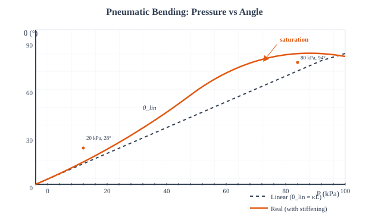
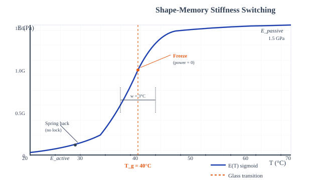
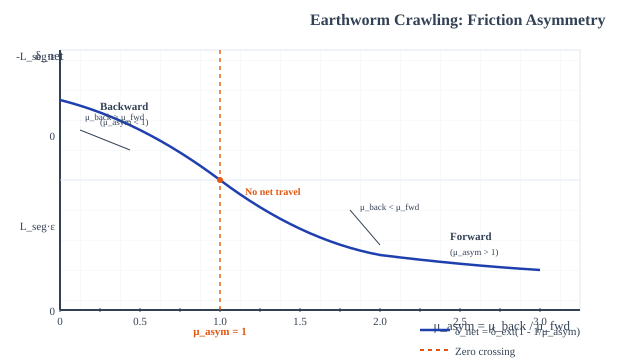
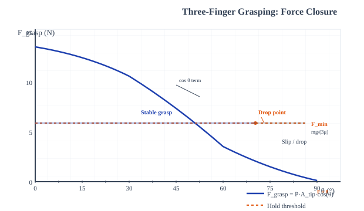
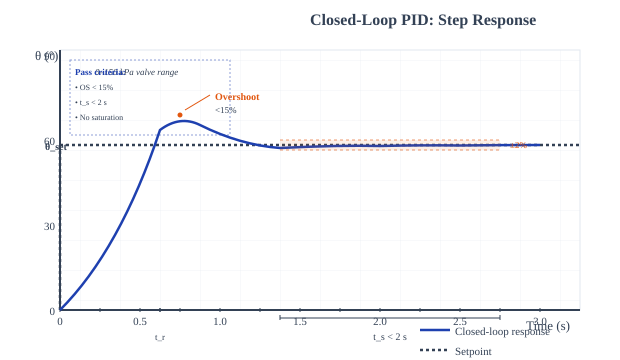

# Theory: 4D-Printed Soft Robots

## 1. Introduction to Soft Robotics and 4D Printing
Conventional robots are built from rigid links and joints; soft robots instead deform their entire body to move, grip, and adapt. When those bodies are 3D-printed from stimuli-responsive materials, the printed part is not the finished robot — heat, pressure, or a control signal reshapes it afterwards. That post-print, time-dependent transformation is the "fourth dimension." This experiment builds a soft finger up in five layers: make it bend, make it hold that bend for free, make a body crawl, make a hand grip, and finally close a control loop so the bend lands exactly where we want it.

---

## 2. Core Concept: Pressure, Modulus, and Friction as Design Knobs
Three physical levers recur throughout soft-robot design. **Pressure** inflates cavities and generates the moments that bend and grip. **Modulus** — how stiff the material is — decides whether a shape springs back or stays put, and in shape-memory polymers it can be switched by temperature. **Friction**, and specifically its directional asymmetry, is what converts symmetric body oscillation into net locomotion. Each sub-calculator isolates one of these levers, then Sub-Calc E ties the pneumatic actuator back into a feedback loop.

---

## 3. Pneumatic Bending Actuation (Sub-Calc A)
An eccentric air cavity offset from the finger's neutral axis converts gauge pressure into a bending moment. With cross-section Across and eccentricity decc:

M = P &middot; Across &middot; decc

That moment bends a beam of effective flexural rigidity E&middot;Ieff into a uniform curvature, and a uniformly curved finger of length L subtends a tip angle:

&kappa; = M / (E &middot; Ieff) &nbsp;&nbsp;&rarr;&nbsp;&nbsp; &theta;lin = &kappa; &middot; L

Here E = 1 MPa (soft silicone), Ieff = 1.82&times;10&minus;10 m4. The linear law only holds while the moment arm stays roughly constant, i.e. for &theta; &lesssim; 30&deg;. Beyond that the cavity geometry stiffens and the finger saturates, captured by an empirical rolloff:

&theta; = &theta;lin / (1 + &beta; &middot; &theta;lin2) &nbsp;&nbsp; (&beta; = 0.0534 rad&minus;2)

The coefficient &beta; is calibrated so that 20 kPa &rarr; 28&deg; and 80 kPa &rarr; 94&deg;: equal pressure steps buy ever less angle as the finger curls.

<em>Figure 1: Pressure drives a moment and hence curvature; the linear angle &theta;lin = &kappa;L (dashed) runs away, but geometric stiffening rolls the real angle off into saturation past ~30&deg; (Sub-Calc A).</em>

---

## 4. Shape-Memory Stiffness Switching (Sub-Calc B)
A pneumatic finger must keep burning pressure to hold a pose. A shape-memory polymer skin removes that cost: bend it while warm and soft, then cool it below its glass transition Tg = 40 &deg;C so it vitrifies and freezes the bend. The modulus follows an empirical sigmoid straddling Tg, running between the warm Eactive and the cold Epassive = 1.5 GPa:

E(T) = Epassive + (Eactive &minus; Epassive) / (1 + exp(&minus;(T &minus; Tg) / w))

with width w = 3 &deg;C. The switch is quantified by the stiffness ratio, and the warm bend and locked hold by:

SR = Epassive / Eactive &nbsp;&nbsp;&middot;&nbsp;&nbsp; &theta;bent = min(90&deg;, kb&middot;Pbend/Eactive) &nbsp;&nbsp;&middot;&nbsp;&nbsp; &theta;held = Rf &middot; &theta;bent

The shape fixity Rf is the fraction of the bend that survives unloading (as in the SMP programming cycle of Exp 1). The payoff is energetic: holding pneumatically leaks power continuously at P&middot;Qleak, whereas once T &lt; Tg the SMP-locked hold costs **exactly 0 W**. If the finger never crosses Tg, releasing pressure lets it spring straight back — no lock.

<em>Figure 2: Cooling through Tg = 40 &deg;C jumps the modulus from Eactive to a ~1.5 GPa glassy state; below Tg the bend holds at zero power, above it the finger springs back (Sub-Calc B).</em>

---

## 5. Earthworm Crawling Locomotion (Sub-Calc C)
A peristaltic body that only extends and contracts goes nowhere if its two ends slip equally — it just breathes in place. Net travel needs directional (anisotropic) friction. Each cycle extends a segment of rest length Lseg = 40 mm by its active strain, and only the fraction set by the friction asymmetry is kept:

&delta;ext = Lseg &middot; &epsilon;active &nbsp;&nbsp;&middot;&nbsp;&nbsp; &mu;asym = &mu;back / &mu;fwd

&delta;net = &delta;ext &middot; (1 &minus; 1/&mu;asym) &nbsp;&nbsp;&middot;&nbsp;&nbsp; v = &delta;net &middot; f

When &mu;asym = 1 the net displacement is exactly zero; when &mu;asym &lt; 1 (more slip while anchoring than advancing) &delta;net goes negative and the robot crawls backward. A smooth 4D-printed surface gives &mu;fwd &asymp; &mu;back, so directional travel demands printed scales or angled legs to break the symmetry.

<em>Figure 3: Net displacement per cycle crosses zero exactly at &mu;asym = 1 — symmetric friction gives no travel, and &mu;asym &lt; 1 reverses the crawl direction (Sub-Calc C).</em>

---

## 6. Three-Finger Grasping & Force Closure (Sub-Calc D)
Three fingers close on an object; each presses with a normal force that depends on how square its contact is. With tip area Atip = 100 mm2 and finger angle &theta;:

Fgrasp = P &middot; Atip &middot; cos&theta;

The reachable workspace runs from the palm radius out to Rmax = rpalm + L&middot;sin&theta; (rpalm = 20 mm). A quasi-static grip holds only if friction at each of the three contacts can carry its share of the weight:

Fgrasp &middot; &mu;contact &gt; m&middot;g / 3

The cos&theta; term is the whole story: as &theta; &rarr; 90&deg; the normal force vanishes and no amount of pressure can save the grip, so the object drops. Inverting the closure condition gives the heaviest object three fingers can hold, mmax = 3&middot;Fgrasp&middot;&mu;/g.

<em>Figure 4: Per-finger grasp force falls as cos&theta; and hits zero at 90&deg;; once it drops below the mg/(3&mu;) threshold the three-finger closure fails and the object is released (Sub-Calc D).</em>

---

## 7. Closed-Loop Bending Control (Sub-Calc E)
The bending finger of Sub-Calc A, seen from a controller, is a first-order pressure-to-angle plant with a fill lag &tau;p and DC gain Kplant = 1.4 &deg;/kPa:

G(s) = Kplant / (&tau;p&middot;s + 1) &nbsp;&nbsp;&hArr;&nbsp;&nbsp; &tau;p &middot; dy/dt = Kplant&middot;u &minus; y

A PID controller drives the valve command u from the tracking error e = &theta;set &minus; y, with the command clamped to the 0&ndash;150 kPa valve range (and integral anti-windup at the rails):

u = Kp &middot; (e + (1/Ti)&int;e&middot;dt + Td&middot;de/dt)

The step response is scored for percent overshoot and 2 % settling time, with a second-order estimate of damping &zeta; (from the overshoot) and closed-loop bandwidth &omega;cl &asymp; 4/(&zeta;&middot;ts). A well-tuned loop meets overshoot &lt; 15 % and ts &lt; 2 s; too much Kp rings, too little never catches the setpoint. Because the plant model is linear, it over-predicts on large steps where the real finger saturates — these gains are a starting point, not the last word on hardware.

<em>Figure 5: The PID loop chases &theta;set; overshoot and the 2 % settling band decide whether the tuning passes, while bad gains ring or saturate the valve limit (Sub-Calc E).</em>

