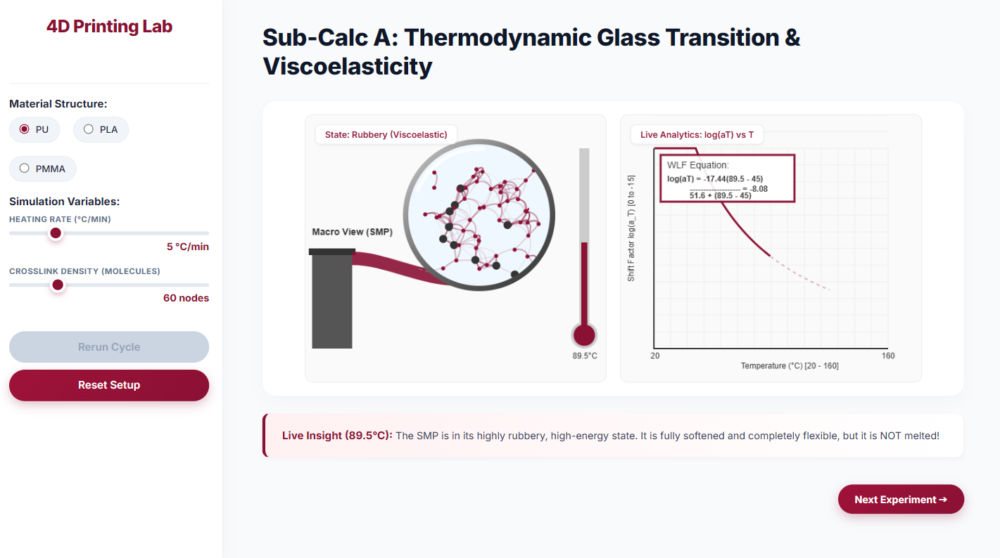
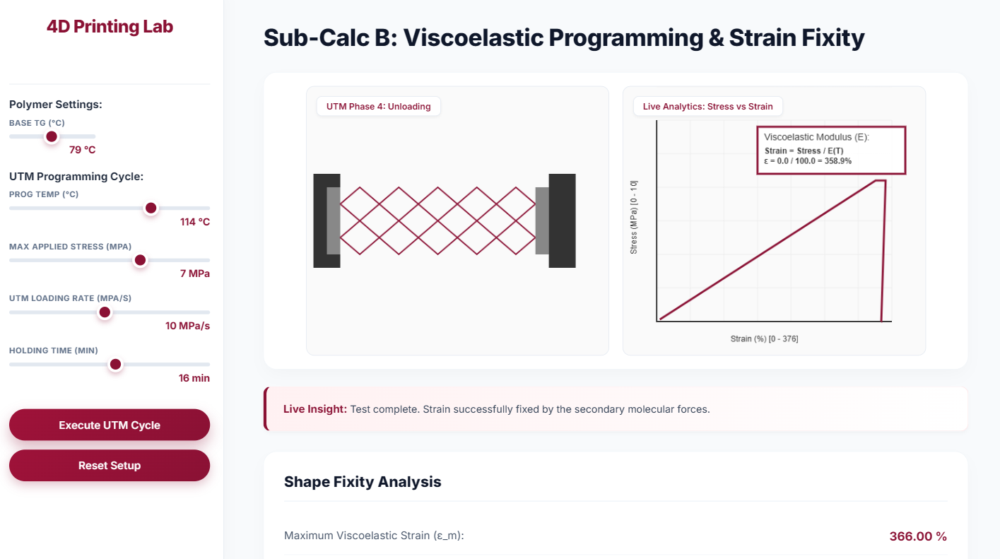
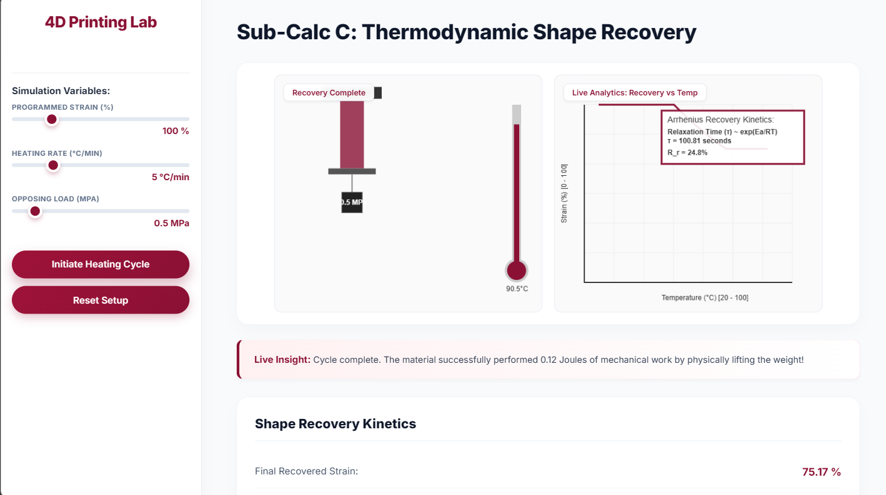
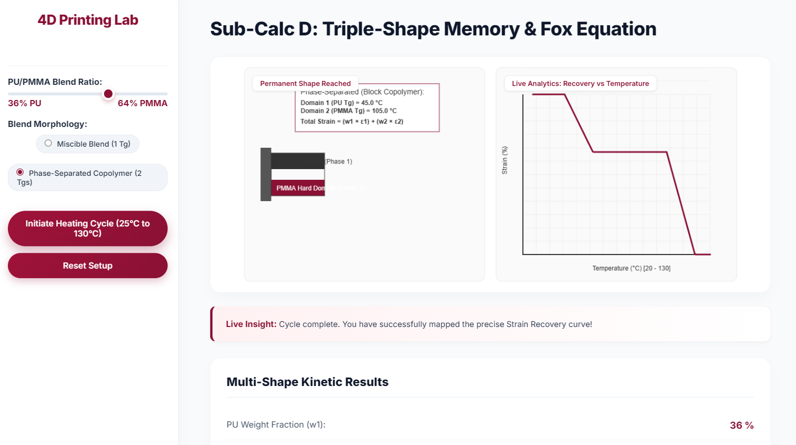
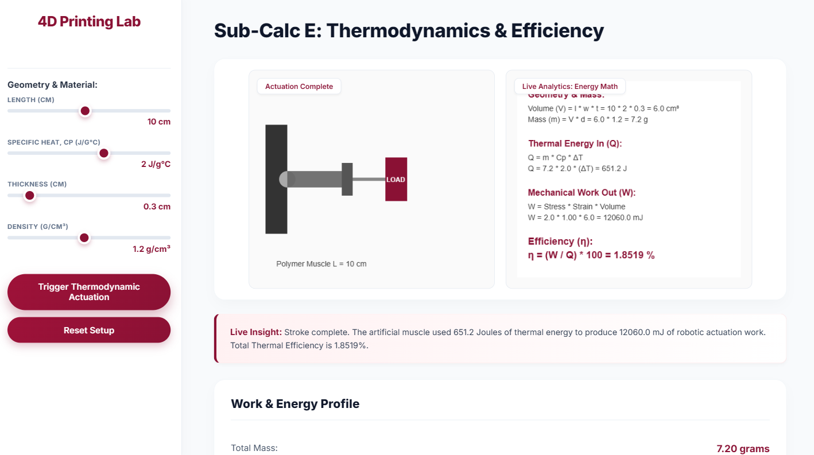

# Procedure: 4D Printing Virtual Lab

Welcome to the 4D Printing Virtual Laboratory. This lab allows you to simulate the thermodynamic and viscoelastic properties of Shape Memory Polymers (SMPs) across five distinct sub-calculators. 

Follow the step-by-step guide below to complete the full Shape Memory Cycle.

## Sub-Calc A: Glass Transition
**Objective:** Observe the shift from a hard, glassy state to a soft, rubbery state and calculate the WLF shift factor.

1. **Select Material:** In the left sidebar, choose your base polymer (e.g., PU, PLA, PMMA).
2. **Set Parameters:** Adjust the Heating Rate and Crosslink Density sliders.
3. **Run Simulation:** Click **Run Thermal Cycle**. Watch the simulation canvas as the temperature increases.
4. **Observe:** Monitor the Live Analytics plot for the $\log(a_T)$ vs $T$ curve. Wait until the polymer reaches its final rubbery state.
5. **Proceed:** Once the simulation completes, click the **Next Experiment 🡒** button at the bottom right.

## Sub-Calc B: Strain Fixity (Programming)
**Objective:** Deform the heated polymer and cool it to lock in the temporary shape.

1. **Apply Force:** Use the slider in the sidebar to apply an external stress to the rubbery polymer.
2. **Deform:** Click **Apply Force**. Observe the viscoelastic creep on the canvas as the polymer chains stretch.
3. **Cool & Lock:** Once fully stretched, click **Cool to Lock Shape**. The temperature will drop below $T_g$, freezing the chains in place.
4. **Proceed:** When the temporary shape is locked, click the **Next Experiment 🡒** button.

## Sub-Calc C: Shape Recovery
**Objective:** Reheat the programmed polymer to observe autonomous shape recovery.

1. **Initiate Recovery:** Click **Reheat & Recover**.
2. **Observe:** Watch the molecular netpoints pull the chains back to their original configuration as the temperature rises above $T_g$.
3. **Analyze:** Note the Shape Recovery Ratio ($R_r$) in the results box.
4. **Proceed:** Click the **Next Experiment 🡒** button.

## Sub-Calc D: Multi-Shape Memory
**Objective:** Explore complex actuations using a phase-separated copolymer with two Glass Transition temperatures.

1. **Configure Blend:** Use the slider to set the blend ratio between Polymer A (Low $T_g$) and Polymer B (High $T_g$).
2. **Run Cycle:** Click **Run Phase Transition**.
3. **Observe Two-Stage Recovery:** 
   - First, as $T$ crosses $T_{g1}$, the first domain melts, recovering an intermediate shape.
   - Second, as $T$ crosses $T_{g2}$, the second domain melts, recovering the final permanent shape.
4. **Proceed:** Click the **Next Experiment 🡒** button.

## Sub-Calc E: Actuation Energy
**Objective:** Calculate the mechanical work generated during shape recovery.

1. **Set Resistance:** Adjust the external load that the polymer must push against during recovery.
2. **Run Actuation:** Click **Run Actuation Cycle**.
3. **Analyze:** Review the Work Capacity graph. This represents the total Actuation Energy density of your material.

---

