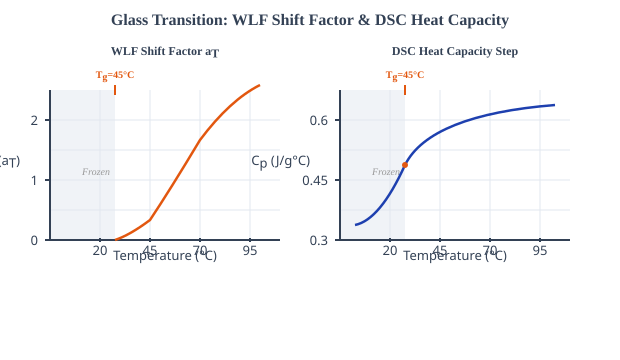
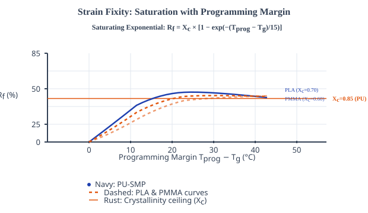
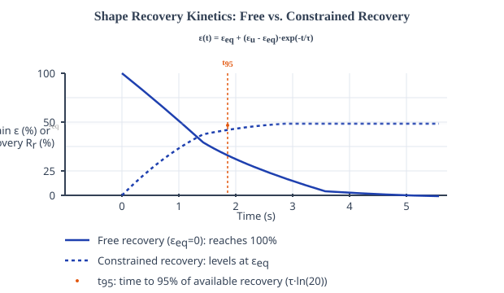
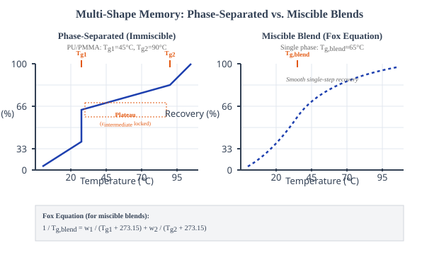
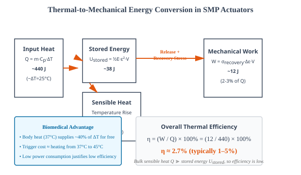

# Theory: Shape Memory Polymers in 4D Printing

## 1. What "4D" adds to printing
A 3D print is done the moment it leaves the build plate. A 4D print isn't. It's built so that some time later, when something in its surroundings changes, it folds, curls, expands, or straightens into a second shape you planned in advance. That response over time is the extra dimension. Heat triggers most 4D prints, though light, moisture, and magnetic fields all get used too. When the trigger is thermal, the material of choice is a **Shape Memory Polymer (SMP)**, so the rest of this lab is really a close look at how one class of SMP behaves while you heat it and cool it.

---

## 2. Why a polymer can "remember" a shape
An SMP carries two shapes at once: a permanent one it keeps trying to return to, and a temporary one you can lock it into. Two structural features make that possible.

- **Netpoints** are the permanent crosslinks (chemical or physical). They store the memory of the original shape and supply the entropic restoring force that pulls the chains back once they're free to move.
- **Switching segments** are the chain portions that stiffen and soften around a thermal transition. Below the transition they're frozen and hold whatever shape they were cooled into; above it they flow and let the netpoints win.

For amorphous SMPs the transition that matters is the **glass transition temperature Tg**. Cool the switching segments below Tg while they're under strain and the temporary shape stays trapped; heat them back through Tg and the entropic spring-back pulls the permanent shape back. The five sub-calculators put numbers on each step of that loop for three model materials: PU-SMP (Tg = 45&deg;C), PLA-SMP (60&deg;C), and PMMA-SMP (105&deg;C).

---

## 3. Glass Transition & the WLF Shift (Sub-Calc A)
Crossing Tg changes the modulus by orders of magnitude. Below it the polymer is a stiff glass (E &sim; 1.5-3 GPa); above it segmental motion switches on and the material softens to a rubber (E &sim; 15-30 MPa). Once the chains are mobile, how fast they relax is set by the **Williams-Landel-Ferry (WLF)** equation, which gives the shift factor aT, the ratio of relaxation time at T to relaxation time at Tg:

log(aT) = &minus;C1(T &minus; Tg) / (C2 + (T &minus; Tg)) &nbsp;&nbsp; for T &ge; Tg

Here C1 = 17.44 and C2 = 51.6 K are the "universal" WLF constants, and aT = 10log(aT) is the viscosity (relaxation-time) ratio. Below Tg the equation is left undefined; the glassy relaxation time is effectively infinite, so the simulator marks that zone as frozen instead of plotting a value. The companion DSC trace models heat capacity as a smooth step centred on Tg:

Cp(T) = &Delta;Cp / (1 + exp(&minus;4(T &minus; Tg) / w)) &nbsp;&nbsp; (&Delta;Cp = 0.3 J/g&deg;C, w = 8)

The inflection of that step is exactly the calorimetric Tg. A body-worn device wants Tg near 37&deg;C, so the sub-calc scores each material by |Tg &minus; 37|: under 10&deg;C is good, under 30&deg;C moderate, anything beyond that poor.

<em>Figure 1: Below Tg the shift factor is undefined (glassy zone); above it the WLF curve falls steeply while the DSC heat capacity steps up through its inflection at Tg (Sub-Calc A).</em>

---

## 4. Programming & Strain Fixity (Sub-Calc B)
Programming is how you write the temporary shape in. You load the rubbery polymer under an applied stress &sigma;, cool it below Tg with the stress still held, and only then unload it. In the rubbery state the loading strain is a simple linear response:

&epsilon;load = (&sigma; / Erubbery) &times; 100%

Not all of that strain survives the unload. The fraction that stays is the **strain fixity ratio Rf**, modelled here as a saturating exponential that depends on how far above Tg the programming was done and is capped by the material's crystallinity limit Xc:

Rf = Xc &times; [1 &minus; exp(&minus;(Tprog &minus; Tg) / 15)] &times; 100% &nbsp;&nbsp; for Tprog &ge; Tg

The characteristic margin is 15&deg;C, and Xc is 0.85 for PU, 0.70 for PLA, 0.60 for PMMA, so Rf climbs quickly with programming temperature but never quite reaches 100%. The strain that actually locks in, which the next sub-calc inherits, is:

&epsilon;u = (Rf / 100) &times; &epsilon;load

The saturating model is deliberate: the naive ratio &epsilon;frozen/&epsilon;load can drift above 100%, which is unphysical.

<em>Figure 2: Rf rises as a saturating exponential with the programming margin (Tprog &minus; Tg) and levels off at the crystallinity ceiling Xc (Sub-Calc B).</em>

---

## 5. Shape Recovery Kinetics (Sub-Calc C)
Reheat above Tg and the switching segments unfreeze, so the entropic restoring force takes over. The relaxation time that governs how quickly this happens is the reference time scaled by the WLF shift factor:

&tau;(T) = &tau;ref &times; aT

Recovery then follows first-order kinetics between the starting strain &epsilon;u and an equilibrium strain &epsilon;eq:

&epsilon;(t) = &epsilon;eq + (&epsilon;u &minus; &epsilon;eq) e&minus;t/&tau;

The value of &epsilon;eq depends on the boundary condition. With nothing pushing back (free recovery) the part relaxes all the way, &epsilon;eq = 0 and the recovery ratio reaches 100%. Under an opposing stress &sigma;opp the part can only shrink until the forces balance:

&epsilon;eq = min(&epsilon;u, (&sigma;opp / Erubbery) &times; 100%)

Rr = ((&epsilon;u &minus; &epsilon;recovered) / &epsilon;u) &times; 100%

The stress the specimen pushes back with when it's blocked, the blocking recovery stress, grows with that held strain, and t95 sets the time to reach 95% of the available recovery:

&sigma;recovery = Erubbery &times; &epsilon;eq / 100 &nbsp;&nbsp;&nbsp;&nbsp; t95 = &tau;(T) &middot; ln(20)

<em>Figure 3: Free recovery decays exponentially to zero strain while constrained recovery levels off at &epsilon;eq; the dashed marker shows t95, the time to 95% of the available recovery (Sub-Calc C).</em>

---

## 6. Multi-Shape Memory & the Fox Equation (Sub-Calc D)
Blend two polymers with different transitions and a part can remember more than one temporary shape. The two morphologies behave very differently. A **phase-separated (immiscible)** PU/PMMA blend keeps two distinct domains, PU switching at Tg1 = 45&deg;C and PMMA at Tg2 = 90&deg;C, so heating releases strain in two stages and you get triple-shape recovery. The strain freed at the first transition depends on the blend fractions and the soft/hard moduli:

&epsilon;intermediate = &epsilon;total &times; w1 &times; Eg1,rubbery / (Eg1,rubbery + w2 &times; Eg2,glassy,eff)

with &epsilon;total = 100%, Eg1,rubbery = 15 MPa (soft PU), Eg2,glassy,eff = 7.5 MPa (effective hard PMMA near the transition), and w1 the PU weight fraction. The remaining strain, &epsilon;plateau = &epsilon;total &minus; &epsilon;intermediate, sits on the intermediate shelf until Tg2 releases it. A **miscible** blend instead forms a single phase with one averaged transition, set by the **Fox equation** (temperatures in Kelvin):

1 / Tg,blend = w1 / (Tg1 + 273.15) + w2 / (Tg2 + 273.15)

That single Tg,blend lands between the two component values and gives one-step, dual-shape recovery.

<em>Figure 4: The phase-separated blend recovers in two steps (a plateau between Tg1 and Tg2), while the miscible blend recovers in one step at the Fox-equation Tg,blend (Sub-Calc D).</em>

---

## 7. Actuation Energy & Efficiency (Sub-Calc E)
Treat the SMP as a muscle that lifts a load when heated. One unit identity keeps the bookkeeping clean: 1 MPa = 1 J/cm3, so a modulus times a volume already has units of energy. The elastic energy stored during programming, the heat needed to trigger recovery, and the work delivered against the load are:

Ustored = &frac12; &times; Erubbery &times; &epsilon;u2 &times; V &nbsp;&nbsp;&nbsp;&nbsp; Q = m &times; Cp &times; &Delta;T &nbsp;&nbsp;&nbsp;&nbsp; W = &sigma;recovery &times; &Delta;&epsilon; &times; V

Here Erubbery = 15 MPa, &epsilon;u = 1.0 (100% programmed strain), &sigma;recovery = 1.5 MPa, and the trigger raises the muscle from 20&deg;C to 45&deg;C so &Delta;T = 25&deg;C. The specimen volume is V = length &times; 2.0 cm &times; thickness and its mass is m = V &times; density. The overall thermal-to-mechanical efficiency is just the ratio of useful work to heat spent:

&eta; = (W / Q) &times; 100%

A polymer's sensible heat capacity dwarfs the elastic energy it can store, so most of the input heat goes into raising temperature rather than doing work, and &eta; lands in the low single digits (typically 1-5%). That looks poor on paper. But for a device sitting at body temperature the trigger is nearly free, since ambient body heat supplies most of the &Delta;T, which is why low-efficiency SMP actuators are still attractive in biomedical use.

<em>Figure 5: Of the input heat Q, only a small slice leaves as mechanical work W (aided by the released stored energy Ustored); the rest is sensible heat, so the efficiency &eta; stays low (Sub-Calc E).</em>

---

## 8. Closing the 4D Loop: Time, Cycling and the Acceptance Gate

The five sub-calcs aren't independent. They're one cycle laid out on a time axis, and that
axis is the "4D" in 4D printing. Programming cools the specimen under stress; storage locks the
temporary shape; the trigger heats it back through Tg; and recovery unfolds with the
relaxation time &tau;(T) = &tau;ref &middot; aT, reaching 95% of the available
strain at t95 = &tau;(T) &middot; ln(20). Nothing here's a still image. The shape is a
function of time, and the whole point of the lab is to predict *when* it arrives, not just *where*.

activation passes only if  |Tg &minus; 37&deg;C| is small  AND  t95 fits the device duty window

**Cycling and end of life.** Every program-recover pass leaves a little residual set, so the fixity
Rf and recovery Rr ratios drift downward with repeated use; in practice a device is
called end-of-life once Rr drops below about 0.9. A material that scores "good" on |Tg
&minus; 37| can still fail this durability gate, and the simulator is built to let it fail rather
than always pass.

**Bench bridge.** The elastic modulus that sets the programming strain &epsilon; = &sigma;/Erubbery
and the rubber-elasticity link E = 3G is measured on a real bench in the Engineering Physics
*torsional-pendulum / rigidity-modulus* experiment (Aurora's Engineering College). The formula-proof
pack in `screenshots_references/` maps this virtual experiment to that AICTE lab page.
