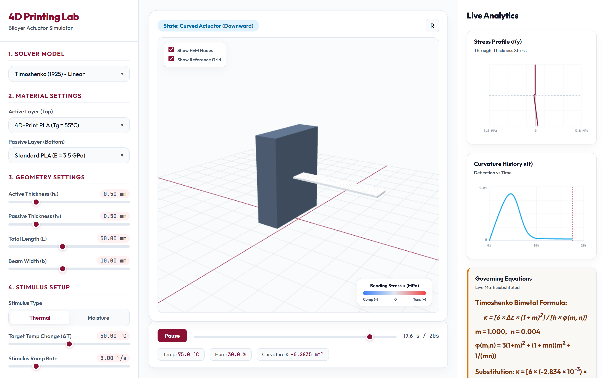
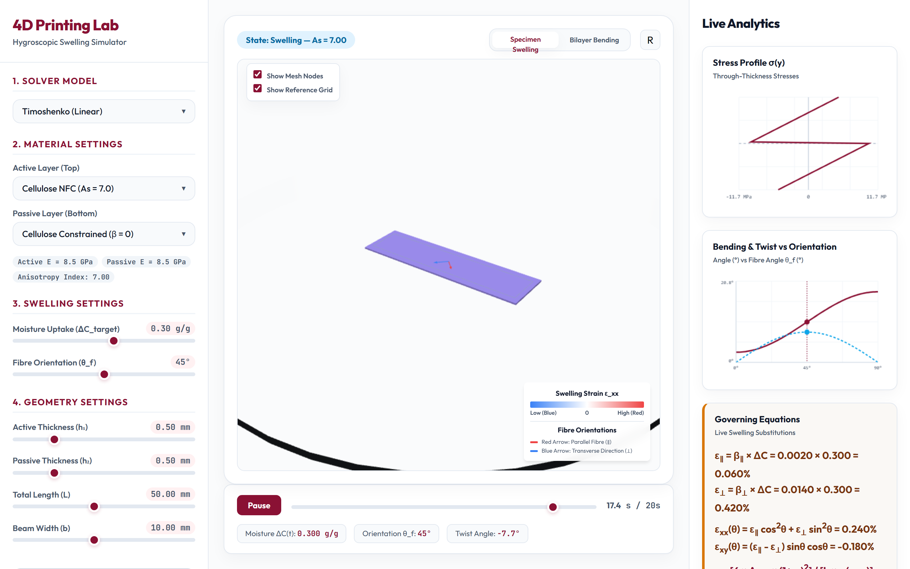
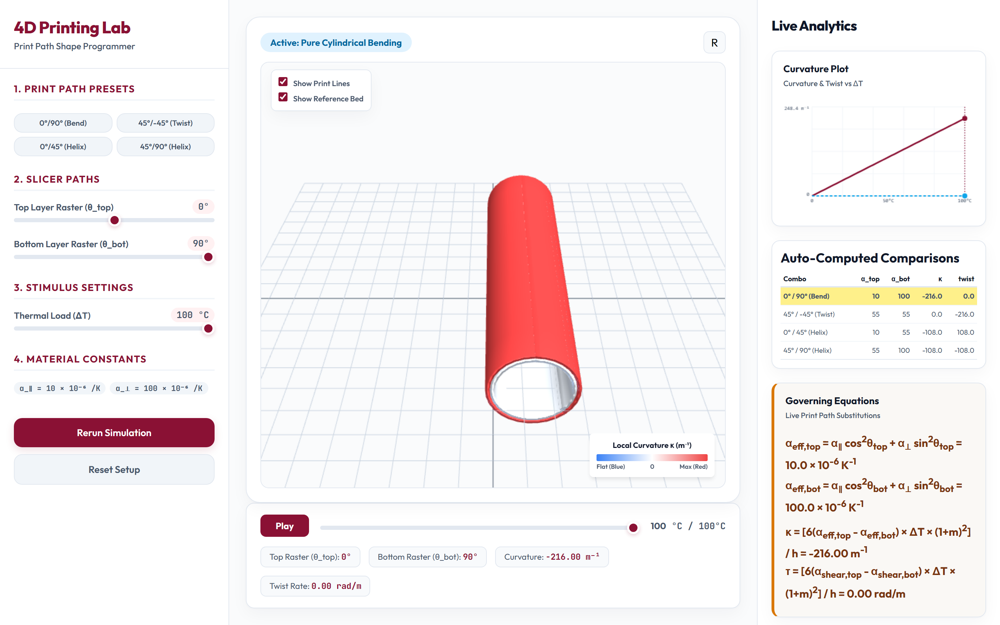
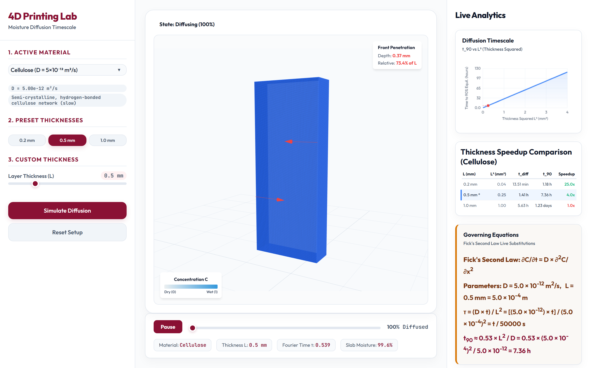
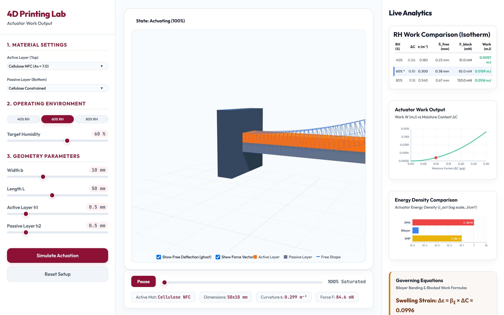

# Theory: Bilayer Actuator Design

## 1. Introduction to Bilayer Actuators
The bilayer actuator is the simplest and most widely used mechanism in 4D printing. It consists of two layers with different expansion responses to a stimulus. When subjected to the stimulus (like heat or moisture), one layer expands more than the other, causing the entire structure to bend.

## 2. Timoshenko Bimetal Formula
The foundational equation for bilayer 4D printed structures is the Timoshenko bimetal formula, originally derived in 1925 for bimetallic thermostats. It relates the curvature of the bending beam to the thermal expansion coefficients, thickness ratio, modulus ratio, and temperature change.

<em>Figure 1: A bilayer of two materials with different expansion bends when stimulated; the Timoshenko bimetal formula sets the curvature from the expansion mismatch, thickness ratio and modulus ratio (Sub-Calc A).</em>

## 3. Hygroscopic Swelling Anisotropy
In addition to thermal expansion, materials like wood or cellulose-based composites undergo hygroscopic swelling when absorbing moisture. Swelling is highly anisotropic, meaning it depends heavily on the fibre orientation. For instance, transverse swelling can be 4-10 times greater than parallel swelling.

<em>Figure 2: Moisture-driven swelling is anisotropic - transverse expansion can be several times the longitudinal value, so the printed fibre orientation steers the bending direction (Sub-Calc B).</em>

## 4. Print Path as Shape Programme
In Fused Deposition Modeling (FDM), the print direction (deposition path angle) acts to program the transformation geometry. The slicer settings are not merely for manufacturing but encode the motion of the part. By altering print angles, the resulting bending can be tuned to produce flat bending, twisting, or helical shapes.

<em>Figure 3: The print-path angle programs the transformation - changing the deposition-line direction turns the same bilayer into flat bending, twisting, or a helix (Sub-Calc C).</em>

## 5. Moisture Diffusion Timescale (Fick's Second Law)
The actuation speed of a moisture-driven bilayer actuator depends on the diffusion timescale. Fick's Second Law governs this moisture diffusion. The characteristic diffusion time scales with the square of the layer thickness (L2), meaning thinner active layers actuate significantly faster.

<em>Figure 4: Fick's second law sets the actuation speed - the diffusion time scales with thickness squared (L2), so a thinner active layer responds much faster (Sub-Calc D).</em>

## 6. Blocking Force & Work Output
The mechanical capability of an actuator is quantified by its blocking force (the force required to prevent bending) and its work output. This connects the mechanics of bending to the thermodynamics of the system, indicating how much energy density the actuator can deliver.

<em>Figure 5: The actuator's mechanical output - the blocking force and work output link the bending mechanics to the energy density the bilayer can deliver (Sub-Calc E).</em>

