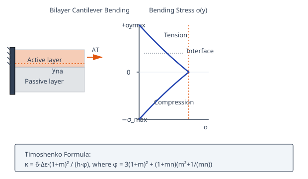
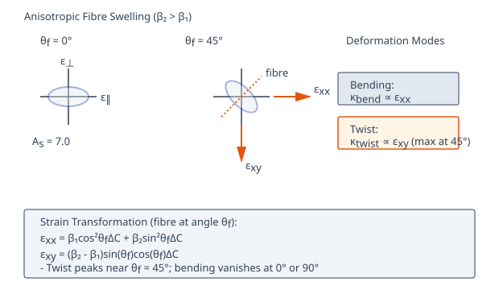
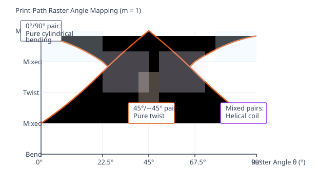
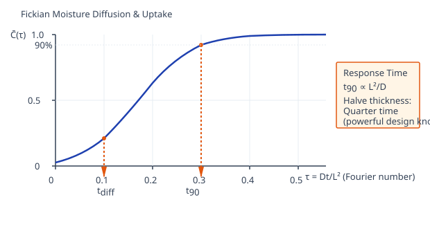
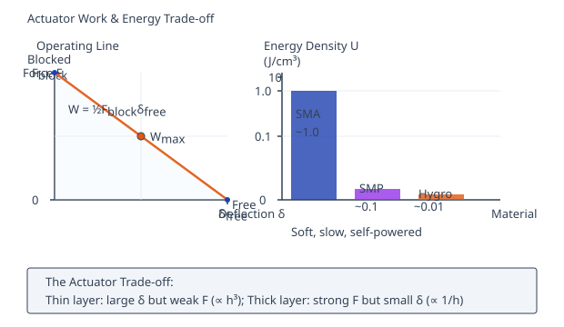

# Theory: Timoshenko Bimetal & 4D-Printed Bilayer Actuators

## 1. Introduction to Bilayer 4D Actuators
A 4D-printed actuator is a structure that changes shape after printing when it meets a stimulus: heat, moisture, light, or a field. The simplest and most robust way to program that change is to laminate two layers that respond differently. When one layer expands (or swells) more than the other, the mismatch strain has nowhere to go but into curvature, and the flat strip bends. It's the same mechanism a household bimetal thermostat uses, and Timoshenko wrote down its governing equation in 1925. Everything in this lab builds on that one bilayer idea.

---

## 2. The Bilayer Mismatch Concept
Two bonded layers share an interface, so they have to keep the same length there. If the active (top) layer wants to grow by a strain &Delta;&epsilon; more than the passive (bottom) layer, the only compatible equilibrium is a uniform curvature &kappa;. Three things set how large that curvature is: the **mismatch strain** &Delta;&epsilon;, the **thickness ratio** m = h1/h2, and the **modulus ratio** n = E1/E2. A stiff, thin active layer on a thick compliant base behaves nothing like the reverse, and the lab lets you feel that trade-off directly.

---

## 3. Timoshenko Bimetal Curvature (Sub-Calc A)
For a thermal stimulus the mismatch strain is &Delta;&epsilon; = (&alpha;2 &minus; &alpha;1)&Delta;T, where &alpha; is the coefficient of expansion of each layer. Timoshenko's closed-form curvature for a bonded bilayer is:

&kappa; = 6 &sdot; &Delta;&epsilon; &sdot; (1 + m)2 / [ h &sdot; &phi; ]

with the geometric/stiffness denominator

&phi; = 3(1 + m)2 + (1 + mn)(m2 + 1/(mn))

where h = h1 + h2 is the total thickness, m = h1/h2 and n = E1/E2. The transformed-section neutral axis (measured from the bottom face) and the effective flexural rigidity are:

yna = [E1h1(h2 + h1/2) + E2h2(h2/2)] / (E1h1 + E2h2)

The through-thickness bending stress follows from the plane-sections strain &sigma;(y) = E(y)&thinsp;[&epsilon;0 + &kappa;(y &minus; yna) &minus; &epsilon;th(y)], and the stored elastic energy is U = &frac12; EIeff &kappa;2 L. The solver also softens each modulus through Tg with a sigmoid and a standard-linear-solid relaxation, so a 4D-Print PLA active layer (Tg = 55&deg;C, Eglassy = 2300 MPa dropping to Erubbery = 25 MPa) loses stiffness as it heats. One caveat: once &kappa;L &gt; 0.3 the small-deflection assumption breaks down and you should switch to the nonlinear elastica solver.

<em>Figure 1: A bonded bilayer converts an expansion mismatch into curvature &kappa;; the transformed section fixes the neutral axis yna and the through-thickness bending stress &sigma;(y) (Sub-Calc A).</em>

---

## 4. Anisotropic Hygroscopic Swelling (Sub-Calc B)
Cellulose-fibre layers swell far more across the fibres than along them. Two swelling coefficients capture this: &beta;1 along the fibre and &beta;2 transverse, giving principal swelling strains

&epsilon;&parallel; = &beta;1 &Delta;C &nbsp;&nbsp;&nbsp; &epsilon;&perp; = &beta;2 &Delta;C

For Cellulose NFC &beta;1 = 0.002 and &beta;2 = 0.014, so the anisotropy index As = &beta;2/&beta;1 = 7.0 (Wood Spruce reaches 10.0). When the fibre runs at an angle &theta;f to the beam axis, a strain-transformation rotates these into the beam frame:

&epsilon;xx = &epsilon;&parallel;cos2&theta;f + &epsilon;&perp;sin2&theta;f &nbsp;&nbsp; &epsilon;xy = (&epsilon;&parallel; &minus; &epsilon;&perp;) sin&theta;f cos&theta;f

The axial part &epsilon;xx feeds the same Timoshenko curvature as Sub-Calc A, while the shear part &epsilon;xy drives a twist through &kappa;xy = 6&thinsp;&epsilon;xy(1 + m)2/(h&phi;). The twist peaks near &theta;f = 45&deg; and drops to zero at 0&deg; or 90&deg;, where the fibre lines up with a principal axis and the coupon bends in pure cylindrical fashion.

<em>Figure 2: Transverse swelling dominates (As = &beta;2/&beta;1); rotating the fibre by &theta;f splits the strain into an axial part that bends and a shear part &epsilon;xy that twists, maximal at 45&deg; (Sub-Calc B).</em>

---

## 5. Print-Path Programming & Effective CTE (Sub-Calc C)
In FDM printing the raster (infill) direction sets the stiff, low-expansion axis of a layer. Treating each printed layer as orthotropic with &alpha;&parallel; = 10&times;10&minus;6/K and &alpha;&perp; = 100&times;10&minus;6/K, the effective longitudinal and shear CTEs of a layer printed at raster angle &theta; are:

&alpha;eff(&theta;) = &alpha;&parallel;cos2&theta; + &alpha;&perp;sin2&theta; &nbsp;&nbsp; &alpha;xy(&theta;) = (&alpha;&parallel; &minus; &alpha;&perp;) sin&theta; cos&theta;

With equal layers (m = 1), the differential longitudinal CTE bends the coupon and the differential shear CTE twists it:

&kappa; = 6(&alpha;eff,top &minus; &alpha;eff,bot)&Delta;T(1 + m)2/h &nbsp;&nbsp; &kappa;twist = 6(&alpha;xy,top &minus; &alpha;xy,bot)&Delta;T(1 + m)2/h

The raster pair is a design knob. 0&deg;/90&deg; maximizes the CTE mismatch for pure cylindrical bending, 45&deg;/&minus;45&deg; cancels bending but programs pure twist, and intermediate pairs (0&deg;/45&deg;, 45&deg;/90&deg;) blend the two into a helix. Matched angles give zero differential strain and only uniform expansion.

<em>Figure 3: The raster angle rotates a layer's effective CTE; matched pairs bend (0&deg;/90&deg;), anti-symmetric pairs twist (45&deg;/&minus;45&deg;), and mixed pairs coil into a helix (Sub-Calc C).</em>

---

## 6. Diffusion & Swelling Timescale (Sub-Calc D)
Moisture-driven actuators are only as fast as water can diffuse into the active layer. For a slab of thickness L wetted on its surface, Fickian transport is governed by the dimensionless Fourier number &tau; = Dt/L2. The slab-average moisture follows the classic series C&#772;(&tau;) = 1 &minus; &Sigma; (8/(k2&pi;2)) exp(&minus;k2&pi;2&tau;) with k = 2n + 1. Two timescales summarize it:

tdiff = L2 / (&pi;2 D) &nbsp;&nbsp;&nbsp; t90 &approx; 0.53 &sdot; L2 / D

The first is the decay time of the slowest Fourier mode; the second is the time to reach 90% of equilibrium uptake, with the moisture front having penetrated roughly 0.73&thinsp;L by then. The telling feature is the L2 scaling: halve the layer thickness and the response time drops to a quarter. Material choice matters just as much, since diffusivity spans two decades from semi-crystalline cellulose (D = 5&times;10&minus;12 m&sup2;/s) up to an open hydrogel network (D = 2&times;10&minus;10 m&sup2;/s).

<em>Figure 4: Fickian uptake sets the actuation speed; t90 &approx; 0.53 L2/D grows with the square of thickness, so thin layers respond far faster (Sub-Calc D).</em>

---

## 7. Actuator Work & Blocking Force (Sub-Calc E)
A useful actuator must do work against a load, not just deflect freely. The free-tip deflection of a cantilever of length L bent to curvature &kappa; is &delta;free = &kappa;L2/2. If the tip is instead held against a rigid stop, it develops a blocking force

Fblock = Eeff h3 b &sdot; &kappa; / (6 L)

using the free radius Rfree = 1/&kappa; and the rule-of-mixtures modulus Eeff = (E1h1 + E2h2)/(h1 + h2). The recoverable mechanical work and its volumetric density are

W = &frac12; Fblock &delta;free &nbsp;&nbsp;&nbsp; U = W / (h b L)

There's an unavoidable trade-off: a thin layer bends far (large &delta;free) but pushes weakly, while a thick layer pushes hard but barely moves, since the h3 in Fblock and the &kappa; &prop; 1/h pull in opposite directions. Relative humidity enters through an equilibrium-uptake curve (60% RH gives 0.10 g/g). Hygromorph energy densities land well below shape-memory alloys (~1.0 J/cm&sup3;) but stay competitive with shape-memory polymers (~0.1 J/cm&sup3;), which is why they suit slow, soft, self-powered actuation.

<em>Figure 5: An actuator trades free deflection against blocking force along a linear operating line; peak work sits at the midpoint, and the resulting energy density is benchmarked against SMA and SMP (Sub-Calc E).</em>

---

## 8. Curvature in Time, the Diffusion Clock and Delamination Life

Bilayer curvature &kappa; looks instantaneous, but for a swelling-driven actuator it develops on a
Fickian clock. The mismatch strain builds as solvent diffuses in, so the bend reaches 90% of its final
value only after t90 &asymp; 0.53 &middot; L&sup2;/D. Thickness dominates: halve the diffusion
length and the response gets four times faster. This time-to-shape is the fourth dimension the actuator
is actually designed around.

actuator passes only if  Fblock &gt; load  AND  t90 meets the response spec

**Cycling and the failure mode.** Repeated swell/deswell cycles the interfacial shear stress between
the two layers (the Suo-Hutchinson interface problem). The usual failure isn't fracture of either
layer but **delamination**, so a durable design keeps the interfacial stress below the adhesion limit,
not just the bulk stress below yield.

**Bench bridge.** The bending stiffness EI = E&middot;b&middot;h&sup3;/12 and the end-deflection law
&delta; = WL&sup3;/3EI that underlie the curvature model are measured in the Strength of Materials
*bending test on a cantilever beam* (IARE). See `screenshots_references/` for the mapped manual page.
