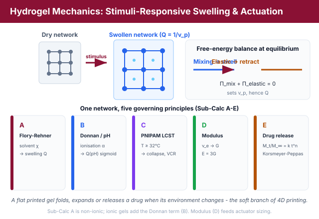
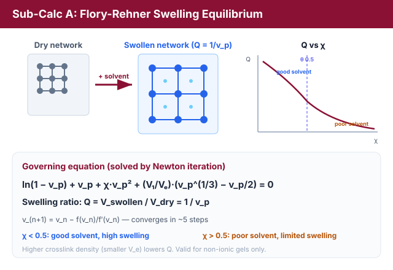
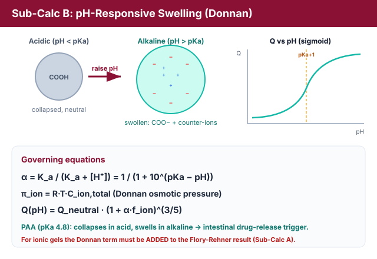
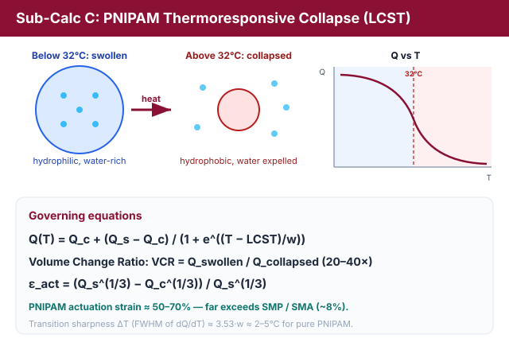
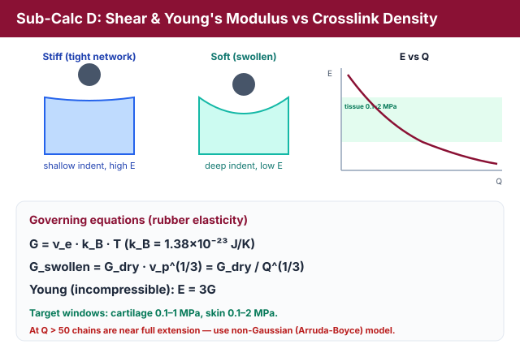
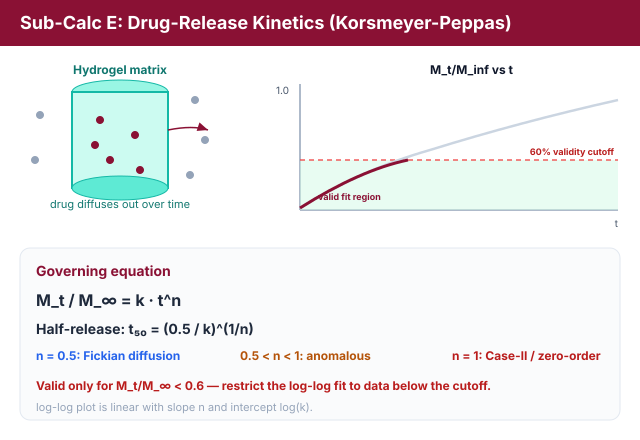
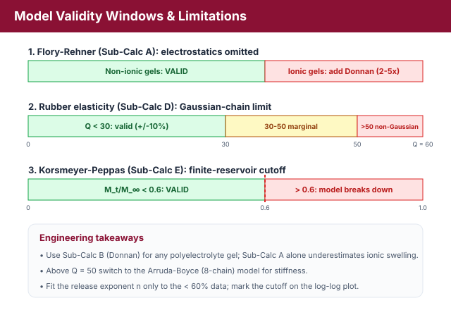

# Theory: Hydrogel Mechanics, Stimuli-Response & Soft Actuator Sizing

## 1. Introduction: Hydrogels as the Biological Interface of 4D Printing
A **hydrogel** is a three-dimensional crosslinked polymer network that absorbs and retains large volumes of water (often many times its dry mass) without dissolving. Because the degree of swelling can be programmed to respond to stimuli such as solvent quality, **pH**, and **temperature**, hydrogels are the natural "soft" branch of 4D printing: a flat printed sheet can be made to fold, bend, or expand on contact with a physiological environment. This experiment quantifies five physical principles that govern hydrogel behaviour, from the thermodynamics of swelling to the kinetics of drug release.

<em>Figure 1: One crosslinked network probed under five stimuli - solvent quality, pH, temperature, crosslink density and time (Sub-Calc A-E).</em>

---

## 2. Flory-Rehner Swelling Equilibrium - The Self-Folding Gripper (Sub-Calc A)
When a dry crosslinked network is placed in a solvent, two opposing free-energy contributions compete:
* **Mixing** (favourable): polymer chains gain entropy by mixing with solvent, driving swelling.
* **Elastic retraction** (unfavourable): as chains stretch, the network develops an entropic restoring force that resists further swelling.

At equilibrium these balance. The **Flory-Rehner equation** sets the total osmotic pressure to zero:

ln(1 - vp) + vp + &chi;&middot;vp2 + (V1/Ve)&middot;(vp1/3 - vp/2) = 0

Where:
* vp = polymer volume fraction at equilibrium (0 &lt; vp &le; 1).
* &chi; = Flory-Huggins polymer-solvent interaction parameter.
* V1 = molar volume of solvent (water &asymp; 18 cm3/mol).
* Ve = molar volume of network strand between crosslinks (a measure of crosslink density: small Ve &rArr; tight network).

The first three terms come from the **mixing** free energy; the last term is the **elastic** contribution. The **equilibrium swelling ratio** is the reciprocal of the polymer volume fraction:

Q = Vswollen / Vdry = 1 / vp

<em>Figure 2: Mixing (favourable) and elastic retraction (unfavourable) balance to set the equilibrium swelling ratio Q = 1/v_p, solved by Newton iteration.</em>

### 2.1 Numerical Solution (Guided Newton Iteration)
The equation is **implicit** in vp and must be solved numerically. Defining f(vp) as the left-hand side, the **Newton-Raphson** update is:

vn+1 = vn &minus; f(vn) / f&prime;(vn)

with derivative

f&prime;(vp) = &minus;1/(1 &minus; vp) + 1 + 2&chi;&middot;vp + (V1/Ve)&middot;(&frac13;vp&minus;2/3 &minus; &frac12;)

Five iterations from a sensible start (v0 &asymp; 0.1) typically converge to machine precision.

### 2.2 Solvent Quality
* &chi; &lt; 0.5 &rArr; **good solvent**: strong mixing, high swelling (Q &gt; 20 for loosely crosslinked gels).
* &chi; = 0.5 &rArr; **theta solvent** (borderline).
* &chi; &gt; 0.5 &rArr; **poor solvent**: limited swelling (Q &lt; 5).

Higher crosslink density (smaller Ve) always reduces Q because the elastic term grows.

---

## 3. pH-Responsive Swelling and Donnan Equilibrium - The pH-Triggered Drug Capsule (Sub-Calc B)
For a weak **polyacid** hydrogel such as poly(acrylic acid) (PAA, pKa &asymp; 4.8), the carboxyl groups ionise as the pH rises. The **degree of ionisation** follows the Henderson-Hasselbalch relation:

&alpha; = Ka / (Ka + [H+]) = 1 / (1 + 10(pKa &minus; pH))

where Ka = 10&minus;pKa and [H+] = 10&minus;pH. Ionisation creates fixed charges on the network. Mobile counter-ions are trapped inside to preserve electroneutrality, producing an extra **Donnan osmotic pressure**:

&pi;ion = R&middot;T&middot;Cion,total

This ionic osmotic pressure swells the gel far beyond its neutral state. Using the scaling form derived from polyelectrolyte (Dobrynin) theory:

Q(pH) = Qneutral &middot; (1 + &alpha;&middot;fion)3/5

<em>Figure 3: As pH rises through pKa, carboxyl groups ionise and trapped counter-ions drive a sigmoidal swelling transition (steepest near pH = pKa + 1).</em>

where fion is the fraction of monomer units bearing an ionisable group. Because &alpha; switches sharply around pH = pKa, the swelling curve Q vs pH is **sigmoidal**, with the steepest rise near **pH &asymp; pKa + 1**. A PAA gel therefore **swells in alkaline media and collapses in acid**, a property exploited to trigger drug release in the intestine rather than the stomach.

---

## 4. PNIPAM Thermoresponsive Collapse: the LCST Transition - The Body-Temperature Valve (Sub-Calc C)
Poly(N-isopropylacrylamide) (PNIPAM) has a **Lower Critical Solution Temperature (LCST)** near **32&deg;C**:
* **Below LCST:** hydrogen bonding with water dominates, the chains are hydrophilic and the gel is highly swollen (Qswollen &asymp; 30&ndash;50 g/g).
* **Above LCST:** hydrophobic interactions win, water is expelled and the gel collapses (Qcollapsed &asymp; 1.1&ndash;1.5 g/g).

The transition is modelled with a logistic (sigmoidal) collapse:

Q(T) = Qcollapsed + (Qswollen &minus; Qcollapsed) / (1 + e(T &minus; LCST)/w)

The transition sharpness is described by the full width at half maximum (FWHM) of the dQ/dT peak, &Delta;Ttransition &asymp; 3.53&middot;w (&asymp; 2&ndash;5&deg;C for pure PNIPAM). Two performance figures follow:

VCR = Qswollen / Qcollapsed &nbsp;&nbsp;(typically 20&ndash;40&times;)

&epsilon;act = (Qswollen1/3 &minus; Qcollapsed1/3) / Qswollen1/3

<em>Figure 4: Across the 32 C LCST the chains switch from a hydrated swollen coil to a collapsed hydrophobic globule, giving a large volume-change ratio and actuation strain.</em>

The linear actuation strain &epsilon;act of a collapsing PNIPAM gel can reach 50&ndash;70%, far exceeding the ~8% recoverable strain of shape-memory polymers (SMP) or shape-memory alloys (SMA), which is why thermoresponsive gels enable large-stroke 4D actuators.

---

## 5. Network Mechanics: Shear and Young's Modulus - The Cartilage Scaffold (Sub-Calc D)
The stiffness of a swollen network is set by **rubber elasticity theory**. For an ideal network of crosslink (strand) density &nu;e (chains per unit volume):

G = &nu;e &middot; kB &middot; T

with kB = 1.38 &times; 10&minus;23 J/K. Swelling dilutes the load-bearing strands, so the modulus of the swollen gel is reduced relative to the dry network:

Gswollen = Gdry &middot; vp1/3 = Gdry / Q1/3

Hydrogels are essentially incompressible (Poisson ratio &asymp; 0.5), so the **Young's modulus** is:

E = 3&middot;G

<em>Figure 5: Rubber elasticity sets G from crosslink density; swelling dilutes the strands so a more swollen gel is softer (G &prop; Q-1/3, E = 3G).</em>

Tuning &nu;e (typically 1023&ndash;1026 chains/m3) lets a designer hit the modulus window of soft tissues, e.g. cartilage (0.1&ndash;1 MPa) and skin (0.1&ndash;2 MPa).

---

## 6. Drug-Release Kinetics: the Korsmeyer-Peppas Model - The Drug-Eluting Implant (Sub-Calc E)
The fraction of a loaded drug released from a swelling matrix follows a power law in time:

Mt / M&infin; = k &middot; tn

where k is the release-rate constant and n is the **diffusion (release) exponent** that classifies the transport mechanism (for a thin slab):
* n = 0.5 &rArr; **Fickian diffusion** (concentration-gradient driven).
* 0.5 &lt; n &lt; 1 &rArr; **anomalous (non-Fickian)** transport: diffusion plus polymer relaxation.
* n = 1 &rArr; **Case-II / zero-order** release (relaxation/erosion controlled).

The **half-release time** is obtained by setting Mt/M&infin; = 0.5:

t50 = (0.5 / k)1/n

<em>Figure 6: Cumulative drug release follows a power law in time; the diffusion exponent n classifies the transport mechanism, valid only below the 60% cutoff.</em>

A log-log plot of Mt/M&infin; versus t is a straight line of slope n and intercept log(k). **The model is only valid for Mt/M&infin; &lt; 0.6**; beyond that the "infinite reservoir" boundary condition fails, so the fit must be restricted to early-time data (see Section 7).

---

## 7. Contradictions and Limitations

<em>Figure 7: Validity windows for the three modelling limitations - ionic correction, Gaussian-chain limit, and the 60% release cutoff.</em>

**Contradiction 1 - Flory-Rehner ignores electrostatics.** The classical Flory-Rehner equation (Sub-Calc A) treats chains as ideal Gaussian coils and contains **no** electrostatic term. For ionic gels (PAA, PAAm) the Donnan osmotic pressure (Sub-Calc B) must be **added** to the Flory-Rehner balance; the simple version underestimates the swelling of polyelectrolyte gels by a factor of 2&ndash;5&times;. **Sub-Calc A is valid only for non-ionic gels**, and its result must not be applied directly to PAA. In this lab the student explicitly computes the Donnan correction and adds it to the Flory-Rehner result for an ionic gel.

**Contradiction 2 - Rubber elasticity fails at high swelling.** G = &nu;ekBT assumes **Gaussian** chain statistics. At very high swelling (Q &gt; 50) the strands approach full extension and enter the **non-Gaussian** regime, where the Arruda-Boyce (8-chain) model is required. For Q &lt; 30 rubber elasticity is accurate to about &plusmn;10%.

**Contradiction 3 - Korsmeyer-Peppas validity window.** The power law holds only for Mt/M&infin; &lt; 0.6. Beyond 60% release the finite drug reservoir invalidates the assumption, so the simulation marks a **60% validity cutoff** and the log-log fit uses only points below it. Thick-panel and burst-release effects are outside this model's scope.

---

## 8. Relevance
Hydrogel science is the biological interface of 4D printing and underpins drug-delivery devices, soft robots, and tissue scaffolds. The Flory-Rehner and Korsmeyer-Peppas models are standard in Pharmaceutical Sciences and Biomedical Engineering curricula, and Sub-Calc E connects directly to India's large generic-pharmaceutical manufacturing sector, linking 4D printing to real industrial applications.
