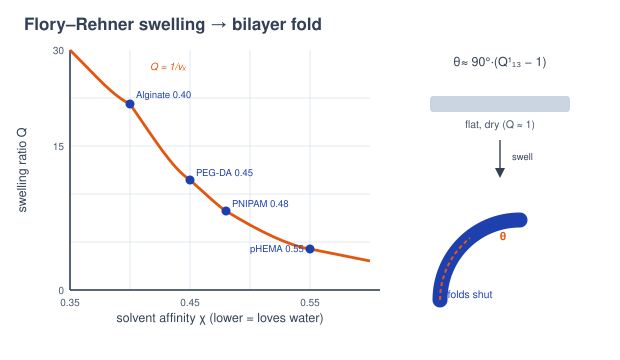
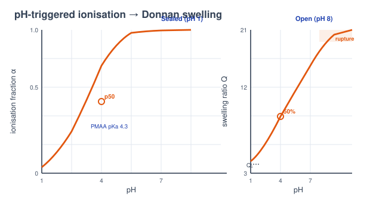
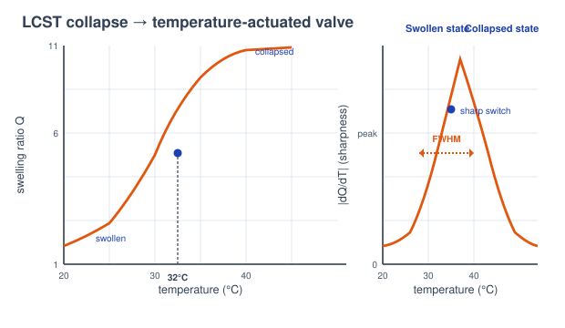
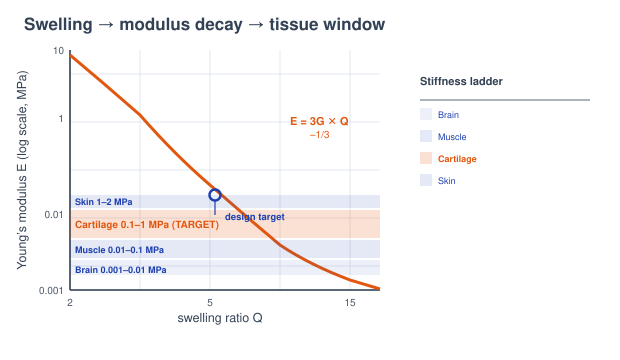
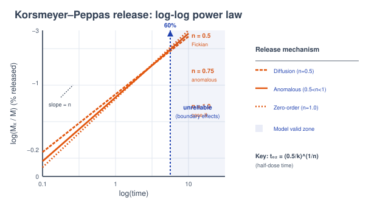

# Theory: Hydrogel Mechanics and Stimuli-Responsive Actuation

## 1. Introduction to Responsive Hydrogels in 4D Printing
A hydrogel is a crosslinked polymer network that soaks up water yet keeps its shape. What makes it a 4D-printing material is that the amount of water it holds isn't fixed; it responds to its surroundings. Change the solvent, the pH, or the temperature and the network swells or collapses, and because a printed part is anisotropic that volume change turns into directed motion: a fold, a valve stroke, a burst of drug. The "fourth dimension" here's the shape change a flat-printed gel performs by itself once it's placed in the body or a beaker. This lab works through five such devices. Each is governed by a different piece of polymer physics, but all of them come back to the same swelling thermodynamics.

---

## 2. Swelling Equilibrium - the Core Concept
Swelling is a tug of war. Mixing polymer with solvent is entropically favourable and pulls water in; stretching the crosslinked chains stores elastic energy and pushes water out. Equilibrium is where the two osmotic contributions cancel. The single number that captures the outcome is the **swelling ratio Q**, the swollen volume divided by the dry volume, equal to the reciprocal of the polymer volume fraction:

Q = Vswollen / Vdry = 1 / vp

Every sub-calc reads off some consequence of Q: a fold angle, an opening fraction, an actuation stroke, a modulus, or a diffusion length. Get Q right and the device behaviour follows.

---

## 3. Flory-Rehner Swelling and the Self-Folding Gripper (Sub-Calc A)
For a neutral gel in a good solvent, the equilibrium polymer volume fraction vp is the root of the **Flory-Rehner equation**, which sets the mixing terms against the elastic term:

ln(1 - vp) + vp + &chi;vp2 + (V1/Ve)(vp1/3 - vp/2) = 0

Here &chi; is the Flory solvent-interaction parameter (lower means more water-loving) and V1/Ve is the crosslink-density term set by the UV cure. The simulation solves this root live with a bracketed damped-Newton scheme, then takes Q = 1/vp. The four print materials sit at &chi; = 0.40 (Alginate), 0.45 (PEG-DA), 0.48 (PNIPAM at 25&deg;C) and 0.55 (pHEMA). A printed bilayer converts the linear swelling strain into curvature, so the finger fold angle scales with the cube-root of Q:

&theta;fold &asymp; 90&deg; &middot; (Q1/3 - 1),&nbsp;&nbsp; capped at 180&deg;

Below about 30&deg; the gripper stays flat and fails; past 160&deg; it closes fully on the object. Lowering &chi; or loosening the crosslinking both raise Q and tighten the fold.

<em>Figure 1: The Flory-Rehner equilibrium sets Q from &chi; and crosslink density; a printed bilayer turns that swelling into the fold angle that closes the gripper (Sub-Calc A).</em>

---

## 4. Ionisation, Donnan Pressure and the pH-Triggered Capsule (Sub-Calc B)
A capsule shell built from a weak polyacid stays neutral, and compact, in stomach acid, then charges up as the pH climbs past its pKa. The fraction of ionised groups follows **Henderson-Hasselbalch**:

&alpha; = 1 / (1 + 10(pKa - pH))

Those fixed charges trap mobile counter-ions inside the gel, and the resulting **Donnan osmotic pressure** pulls in water. The model amplifies the neutral swelling Q0 = 3.0 by the charge the shell carries, using an amplification factor &beta; = 30 and the ionisable fraction fion:

Q = Q0 (1 + &beta; &middot; &alpha; &middot; fion)3/5

The opening fraction is Q normalised between its sealed value at pH 1 and its fully-open value at pH 8, and the capsule is said to spring open at the pH where that fraction reaches 50% (p50). Match p50 to the target organ: PMAA (pKa 4.3) opens earliest, while a custom pKa 6.0 shell holds until deeper in the intestine. There's a failure mode. If fion is too high the shell over-swells past &sim;8&times; its sealed volume (Q > 24) and ruptures, dumping the whole dose at once.

<em>Figure 2: As pH crosses the pKa the shell ionises (Henderson-Hasselbalch) and Donnan pressure swells it open; the opening pH is tuned to release in the intestine, not the stomach (Sub-Calc B).</em>

---

## 5. LCST Collapse and the Body-Temperature Valve (Sub-Calc C)
PNIPAM-type gels do the opposite of most materials: they collapse on heating. Above the **lower critical solution temperature (LCST &asymp; 32&deg;C)** the polymer-water hydrogen bonds break, water is expelled, and the gel shrinks sharply. The swelling fraction is a sigmoid whose width w sets the switch sharpness:

&phi;(T) = 1 / (1 + e(T - 32)/w) &nbsp;&nbsp;&rArr;&nbsp;&nbsp; Q(T) = Qcol + (Qsw - Qcol) &middot; &phi;(T)

with the collapsed floor fixed at Qcol = 1.3. The volume-change ratio is Qsw/Qcol, and the useful linear **actuation stroke** that lifts the valve lid is:

&epsilon; = 1 - (Qcol / Qsw)1/3

The sharpness of the switch is read as the full width at half maximum of the |dQ/dT| peak, computed numerically about 32&deg;C. A gel that only swells to a small Qsw gives too little stroke to unseat the lid, and the valve fails shut even when cold, so both the size change and the sharpness matter for a valve that snaps cleanly as it crosses body temperature.

<em>Figure 3: Crossing the 32&deg;C LCST, the gel collapses along a sigmoid; the actuation stroke &epsilon; and the FWHM of dQ/dT set how far and how sharply the valve moves (Sub-Calc C).</em>

---

## 6. Rubber Elasticity and the Cartilage Scaffold (Sub-Calc D)
The stiffness of a swollen network comes from **affine rubber-elasticity theory**. The dry shear modulus is set purely by how many elastically-effective chains per unit volume &nu;e there are and the thermal energy kBT:

Gdry = &nu;e kB T

Swelling dilutes those chains, dropping the modulus as the cube-root of the concentration, and for an incompressible gel Young's modulus is three times the shear modulus:

Gswollen = Gdry &middot; Q-1/3,&nbsp;&nbsp; E = 3G

The Boltzmann constant is kB = 1.380649 &times; 10-23 J/K and T is in kelvin. The design target is native articular cartilage, which spans roughly 0.1-1 MPa; the tissue map also places brain (&sim;0.001-0.01 MPa), muscle (&sim;0.01-0.1 MPa) and skin (&sim;0.1-2 MPa) for comparison. E falls with swelling, so a more watery scaffold dents deeper; the recipe is to tighten crosslinking until the swollen E lands inside the cartilage window.

<em>Figure 4: Crosslink density sets the dry modulus while swelling softens it as Q-1/3; the scaffold is tuned to sit in cartilage's 0.1-1 MPa band (Sub-Calc D).</em>

---

## 7. Korsmeyer-Peppas Release and the Drug-Eluting Implant (Sub-Calc E)
Once a drug-loaded implant is in place, the early-time release fraction follows the empirical **Korsmeyer-Peppas power law**:

Mt / M&infin; = k tn &nbsp;&nbsp;(valid while released &lt; 60%)

The rate constant k sets how fast the implant empties; the exponent n is the diagnostic. For a thin slab n &asymp; 0.5 signals pure **Fickian diffusion**, n = 1 is **case-II (zero-order, steady)** transport driven by a swelling front, and 0.5 &lt; n &lt; 1 is anomalous transport mixing the two; n &gt; 1 is a super case-II burst. On a log-log plot the release is a straight line whose slope reads off n directly:

log(Mt/M&infin;) = log k + n &middot; log t

Inverting the power law gives the dosing timescales: the half-dose time is t50 = (0.5/k)1/n, and the model is only trusted up to the 60% cutoff, beyond which the geometry and boundary effects the power law ignores start to dominate.

<em>Figure 5: The Korsmeyer-Peppas exponent n classifies release from Fickian diffusion to steady zero-order; the fit is trustworthy only below the 60% cutoff (Sub-Calc E).</em>

---

## 8. Two Clocks - Swelling Equilibrium versus Release Kinetics

A stimuli-responsive hydrogel runs on two different timescales, and keeping them apart is the key to the
lab. Swelling relaxes toward the Flory-Rehner equilibrium ratio Q (a state the gel settles into), while
transport out of the gel follows the Korsmeyer-Peppas law Mt/M&infin; = k tn,
valid up to about 60% release. The therapeutic behaviour lives in *time*: how long the valve stays open,
how fast the drug leaves. That is the fourth dimension of the device.

implant passes only if release exponent n and duration land in the therapeutic window (burst release fails)

**Cycling and ageing.** Repeated swell/collapse cycles fatigue the network by chain scission, which lowers
the crosslink density &nu;e and therefore the modulus (E = 3G, G = &nu;ekBT).
End of life is when the softened gel can no longer hold its actuated shape or valve pressure.

**Bench bridge.** The first-order release / degradation law, ln M = ln M0 &minus; kt, is exactly
the kinetics measured in the Chemical Reaction Engineering *isothermal batch-reactor rate-constant*
experiment (IIT (ISM) Dhanbad). The mapped manual page is in `screenshots_references/`.
