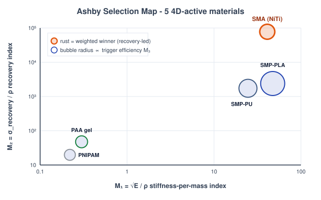
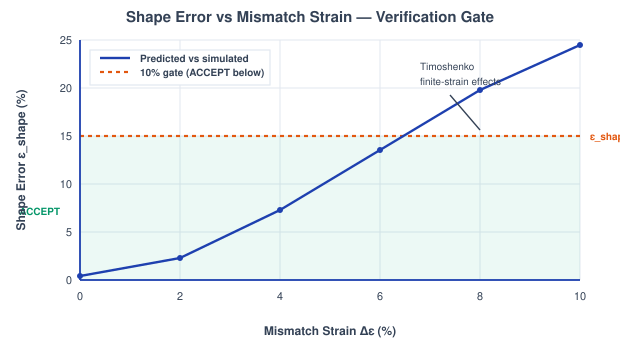
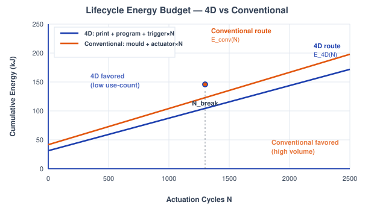
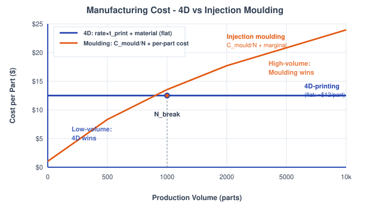
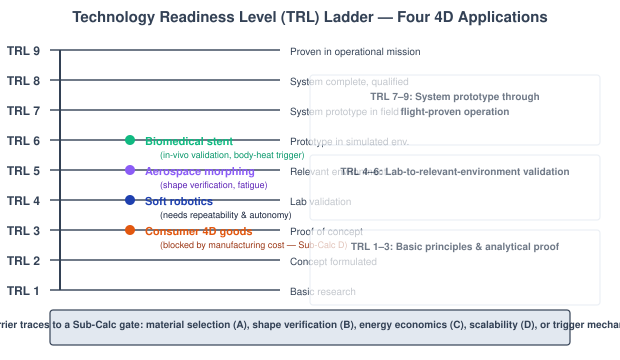

# Theory: Integrated 4D Design Review

## 1. What a Design Review Adds to 4D Printing
The earlier experiments each isolated one physics of a shape-changing part: the glass transition, the bilayer bend, the bioprinting window. A real project can't stop there. Before a 4D-printed structure ships you have to answer five blunt engineering questions in sequence: *which material, does the transformation actually verify, is it worth the energy, does it scale, and is it ready?* This capstone is that review. Each sub-calc is a decision gate, and several deliberately inherit numbers from earlier experiments (SMP recovery ratio Rr from Exp 1, the Timoshenko bilayer from Exp 2, the bioprinting constraints from Exp 7) so the review closes the loop rather than starting from scratch.

---

## 2. Design as a Chain of Contradictions
No stage is decided in isolation. A material that wins on recovery stress loses on stiffness; a transformation that verifies at small strain fails at large strain; a free trigger that saves energy carries a biocompatibility risk. The review is honest about these trade-offs: every sub-calc surfaces a *contradiction* it can't fully resolve, and the final TRL assessment traces each application's readiness barrier back to the specific sub-calc that owns that contradiction.

---

## 3. Ashby Materials Selection (Sub-Calc A)
Five 4D-active materials, SMP-PLA, SMP-PU, SMA (NiTi), a PAA hydrogel, and PNIPAM, are scored on three performance indices, each written so that **larger is better**:

M1 = &radic;E / &rho; &nbsp;&nbsp; M2 = &sigma;recovery / &rho; &nbsp;&nbsp; M3 = &eta; &middot; Estored / Qtrigger

M1 is the classic bending-stiffness-per-mass index for a light actuator, M2 the recovery (actuation) stress per unit mass, and M3 the thermal-trigger efficiency. Because the three indices span many orders of magnitude, each is min-max normalized across the five candidates to a common [0,1] scale:

M&#770;i = (Mi &minus; Mmin) / (Mmax &minus; Mmin)

The application enters through three weights, which the tool auto-normalizes so they sum to one:

Mtotal = w1&middot;M&#770;1 + w2&middot;M&#770;2 + w3&middot;M&#770;3

The key result: the winner is a function of the weighting, not of the material. Weight recovery stress and NiTi wins the stent; weight stiffness and SMP-PLA wins the gripper. The linear weighted sum ignores property correlations (stiff often means brittle), so it's a *screening* tool, not the final word.

<em>Figure 1: The Ashby map of M1 = &radic;E/&rho; against M2 = &sigma;recovery/&rho;: NiTi dominates recovery, the SMPs dominate stiffness-per-mass, and the weighted winner slides between them with the application (Sub-Calc A).</em>

---

## 4. Transformation Verification (Sub-Calc B)
Design intent is a target radius R, giving a predicted curvature

&kappa;pred = 1 / R

The finite-strain simulation returns a different curvature &kappa;sim, and verification is the comparison of the two through a shape error with a hard acceptance band:

&epsilon;shape = |&kappa;sim &minus; &kappa;pred| / &kappa;pred &times; 100 % &nbsp;&nbsp; (ACCEPT if &epsilon;shape &lt; 10 %)

The inherited **Timoshenko bilayer** (Exp 2) gives the small-strain curvature from the mismatch strain &Delta;&epsilon;, thickness ratio m = h1/h2, and modulus ratio n = E1/E2:

&kappa; = 6&Delta;&epsilon;(1 + m)2 / (h &middot; &phi;), &nbsp;&nbsp; &phi; = 3(1 + m)2 + (1 + mn)(m2 + 1/(mn))

which the tool inverts to back-solve the total thickness h. Because Timoshenko is linear (&kappa; &prop; &Delta;&epsilon;), &kappa;sim pulls away from &kappa;pred as &Delta;&epsilon; grows or as m,n leave the calibrated band. The alternative **SMP-recovery** source (Exp 7) instead scales &kappa;sim by the inherited recovery ratio Rr = 92 %: incomplete recovery drags the simulated curvature below target while finite strain overshoots, and the two compete. When the gate fails, the module reports the dominant culprit term.

<em>Figure 2: Shape error &epsilon;shape climbing with mismatch strain &Delta;&epsilon;; below the 10 % line the folded &kappa;sim matches the &kappa;pred = 1/R target and the part is accepted (Sub-Calc B).</em>

---

## 5. Lifecycle Energy Budget (Sub-Calc C)
A 4D part is printed once and cycled many times; a conventional part is moulded once and driven by a powered actuator every cycle. The three 4D terms are:

Eprint = P &middot; tprint, &nbsp;&nbsp; Eprogram = m&middot;Cp&middot;&Delta;T, &nbsp;&nbsp; Etrigger per cycle

with Cp = 1800 J/(kg&middot;K) and &Delta;T = 35 K for PLA. The trigger term is the decisive contradiction: body-heat &asymp; 0 J, Joule/SMA I&sup2;Rt &asymp; 200 J, photo/magnetic Q &asymp; 500 J per cycle. Over N cycles the two routes are:

E4D(N) = Eprint + Eprogram + Etrigger&middot;N &nbsp;&nbsp; vs &nbsp;&nbsp; Econv(N) = Emould + Eactuator&middot;N

with Eactuator = 100 J/cycle. Setting the two equal gives the break-even cycle count:

Nbreak = (Emould &minus; Eprint &minus; Eprogram) / (Etrigger &minus; Eactuator)

If Etrigger &lt; Eactuator, the body-heat case, the 4D line never gets overtaken and 4D wins for every N. That free biological trigger is why body-temperature SMPs are so compelling in biomedicine.

<em>Figure 3: Lifecycle energy versus actuation cycles N: a per-cycle trigger cost lets the moulded-plus-actuator route catch the 4D part at Nbreak, unless the trigger is free (Sub-Calc C).</em>

---

## 6. Manufacturing Scalability (Sub-Calc D)
Additive manufacturing has no tooling cost but no economy of scale, so its cost per part is flat, while injection moulding amortizes a large fixed mould over the run. The print time follows the volumetric FDM rate (&asymp; 4 mm&sup3;/s):

tprint = Vpart / (Alayer&middot;vprint&middot;hlayer)

C4D = rate&middot;tprint + Cmaterial &nbsp;&nbsp; (flat), &nbsp;&nbsp; Cinj(N) = Cmould/N + Cmarginal

with the material price at $0.025/g and the injection marginal cost (material + labour) lumped at $0.40/part. The two cost curves cross at:

Nbreak = Cmould / (C4D &minus; Cmarginal)

Below Nbreak, customised low-volume work belongs to 4D-printing; above it, moulding wins on unit cost. This crossover, not any physics of the material, is what keeps mass-market 4D goods stuck at a low readiness level.

<em>Figure 4: Cost per part versus production volume: flat for 4D-printing, falling as Cmould/N for moulding, crossing at the volume where the two manufacturing routes swap places (Sub-Calc D).</em>

---

## 7. Technology Readiness Assessment (Sub-Calc E)
The final gate is qualitative. Each application is placed on the NASA/ISRO **Technology Readiness Level** ladder, grouped into three bands: TRL 1-3 basic principles and analytical proof, TRL 4-6 lab-to-relevant-environment validation, and TRL 7-9 system prototype through flight-proven operation. The four review applications sit at:

Biomedical stent TRL 6 &nbsp;&middot;&nbsp; Aerospace morphing TRL 5 &nbsp;&middot;&nbsp; Soft robotics TRL 4 &nbsp;&middot;&nbsp; Consumer 4D goods TRL 3

Each barrier to the next rung traces to an earlier contradiction: the stent's in-vivo uncertainty to the Sub-Calc B shape-error gate and the Exp 7 shear-kill window, consumer goods to the Sub-Calc D scalability crossover, soft robotics to the Sub-Calc A trigger mechanism and cyclic repeatability. TRL is a contested, self-assessed scale, so it's cited as a reference position rather than a measured fact.

<em>Figure 5: The TRL 1-9 ladder with each application on its current rung and the barrier blocking the next step, the review's closing judgement on whether the technology is ready (Sub-Calc E).</em>

---

## 8. Time and Volume Close the 4D Case

The final review integrates every earlier experiment over the life of the product. Lifecycle energy is a
running sum, E4D(N) = Eprint + Eprogram + Etrigger&middot;N,
weighed against a conventional route with a break-even at Nbreak; cost follows the same shape.
The fourth dimension here's scale: the technology only pays off across enough transformation cycles N and
enough production volume, so "does it transform" has to become "does it transform economically, at a fleet
level, for its whole service life."

design is ACCEPTED only if  &epsilon;shape = |&kappa;sim &minus; &kappa;pred|/&kappa;pred &times; 100% &lt; 10%

**Selection and maturity.** The Ashby indices M1 = &radic;E/&rho;, M2 =
&sigma;recovery/&rho;, M3 = &eta;Estored/Qtrigger rank candidate
materials, while the TRL ladder places maturity honestly: a self-deploying stent near TRL 6, consumer 4D
goods nearer TRL 3. The review is allowed to reject.

**Bench bridge.** The Young's modulus E that feeds the stiffness index M1 = &radic;E/&rho; is
measured in the Strength of Materials *beam-deflection / Young's modulus* experiment (IARE), E =
WL&sup3;/48&delta;I. Mapped page in `screenshots_references/`.
