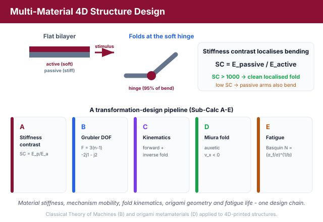
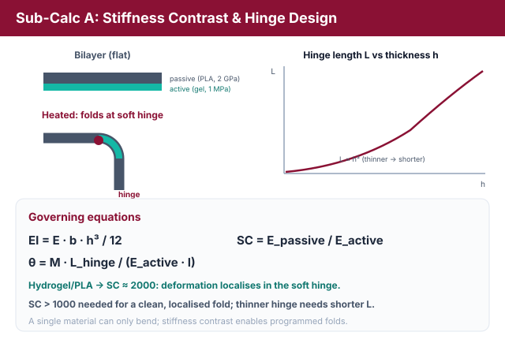
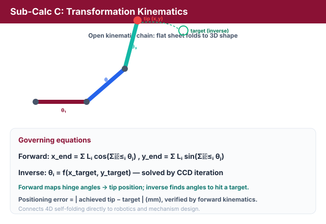
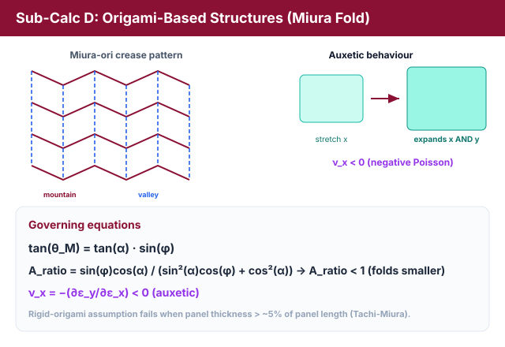
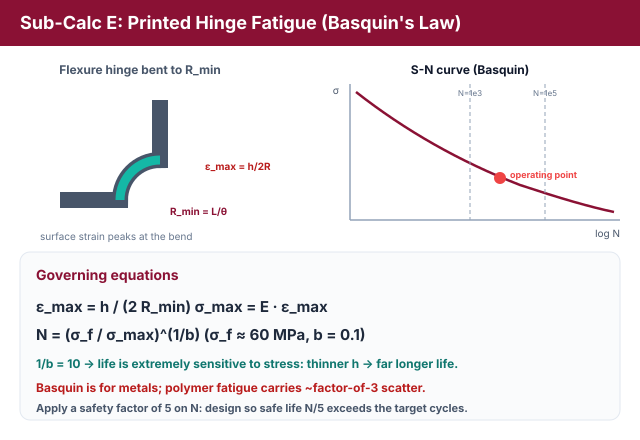
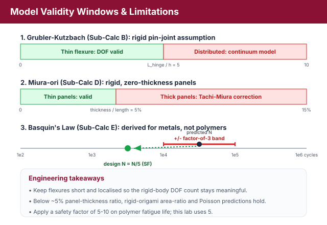

# Theory: Multi-Material 4D Structure Design

## 1. Why Multi-Material 4D Printing?
A single homogeneous material can only bend. To make a flat printed sheet **fold, twist, and self-assemble** into a prescribed 3D shape, designers combine materials of very different stiffness so that deformation localises where it is wanted. This experiment links classical mechanics, the Theory of Machines, and origami metamaterials to the design of transforming 4D-printed structures.

<em>Figure 1: The five sub-calculations form one transformation-design pipeline - stiffness contrast, mobility, kinematics, origami and fatigue.</em>

---

## 2. Stiffness Contrast & Hinge Design - The Self-Folding Flat-Pack Box (Sub-Calc A)
A bilayer of an **active** layer (e.g. a soft E&nbsp;=&nbsp;1&nbsp;MPa hydrogel) and a **passive** layer (e.g. a stiff E&nbsp;=&nbsp;2&nbsp;GPa PLA) bends because the two layers respond differently to a stimulus. The bending resistance of a rectangular cross-section (width b, thickness h) is its **flexural rigidity**:

EI = E &middot; b &middot; h&sup3; / 12

The **stiffness contrast ratio** between the two materials is:

SC = Epassive / Eactive

For a hydrogel/PLA pair, SC &asymp; 2&times;109/1&times;106 = **2000**. A high SC forces essentially all of the deformation into the soft hinge, mimicking a biological joint. The rotation of a soft flexure hinge of length Lhinge under an applied bending moment M is, from beam theory:

&theta; = M &middot; Lhinge / (Eactive &middot; I)

<em>Figure 2: A high stiffness contrast concentrates the bending in the soft hinge; the required hinge length scales with the cross-section (Lhinge &prop; h&sup3;).</em>

Rearranging gives the **hinge length** needed for a target fold angle &theta;: Lhinge = &theta;&middot;Eactive&middot;I / M. Because I = b&middot;h&sup3;/12, a **thinner active hinge** (smaller h) is more compliant and needs a **shorter** Lhinge to reach the same angle. The design rule is that the minimum stiffness contrast to keep deformation in the hinge scales with the moment and geometry; in practice **SC &gt; 1000** is required for clean, localised folding.

---

## 3. Degrees of Freedom: the Grubler-Kutzbach Criterion - The Self-Closing Gripper Mechanism (Sub-Calc B)
A transforming structure is a **mechanism**, so its mobility can be predicted with the **Grubler-Kutzbach** criterion for planar mechanisms:

F = 3(n - 1) - 2&middot;j1 - j2

where n is the number of rigid **links** (the fixed ground counts as one), j1 is the number of **full joints** (lower pairs, 1 relative DOF, each removing 2 DOF), and j2 is the number of **half joints** (higher pairs, 2 relative DOF, each removing 1 DOF). In a compliant 4D-printed mechanism a **flexure hinge** plays the role of a full joint. To find the links needed for a target mobility:

n = (F + 2&middot;j1 + j2) / 3 + 1

<em>Figure 3: The Grubler-Kutzbach criterion predicts whether a compliant mechanism is over-constrained (locked), correctly mobile (F = 2), or under-constrained (floppy).</em>

For a self-folding gripper we usually want **F = 2** (open/close plus a lateral motion). The mobility tells us the regime:
* **F &lt; target (e.g. F = 0):** over-constrained - the structure is rigid/locked and cannot transform regardless of stimulus magnitude.
* **F = target:** correctly mobile.
* **F &gt; target:** under-constrained - floppy, with uncontrolled extra motions.

Adding a constraint (a full or half joint) lowers F; adding a link raises F. This is the first time classical Theory-of-Machines mobility analysis is applied directly to a 4D-printing design problem.

---

## 4. Transformation Kinematics: Forward & Inverse - Folding a Sheet to a Target Shape (Sub-Calc C)
A flat strip that folds into a 3D shape is an **open kinematic chain**. With link lengths Li and hinge angles &theta;i, **forward kinematics** maps the angles to the position of the free (end-effector) tip by accumulating the rotations:

xend = &Sigma;i Li cos(&Sigma;j&le;i &theta;j) , &nbsp; yend = &Sigma;i Li sin(&Sigma;j&le;i &theta;j)

<em>Figure 4: Forward kinematics maps hinge angles to the folded end-effector position; inverse kinematics (CCD) solves the angles needed to reach a target shape.</em>

**Inverse kinematics** is the reverse problem: given a target shape or tip position, find the hinge angles &theta;i = f(xtarget, ytarget) that achieve it. For a folding box from a flat sheet the simulation computes the required fold angles, then verifies them by running forward kinematics and reporting the **maximum deviation (positioning error, mm)** from the target. This directly connects 4D printing to robotics and mechanism design.

---

## 5. Origami-Based Structures: the Miura Fold - The Deployable Miura Panel / Stent (Sub-Calc D)
The **Miura-ori** is the origami pattern behind deployable satellite solar panels, foldable maps, and 4D-printed metamaterials. For a sheet with sector angle &alpha; folded to a fold angle &phi;, the mountain-valley dihedral angle is:

tan(&theta;M) = tan(&alpha;) &middot; sin(&phi;)

The **flat-to-folded area ratio** (how much the footprint shrinks) is:

Aratio = sin(&phi;) cos(&alpha;) / (sin&sup2;(&alpha;) cos(&phi;) + cos&sup2;(&alpha;))

Most strikingly, the Miura-ori has a **negative (auxetic) Poisson's ratio**: stretching it in one in-plane direction makes it expand in the perpendicular in-plane direction as well:

&nu;x = &minus;(&part;&epsilon;y/&part;&epsilon;x) &lt; 0

<em>Figure 5: The Miura-ori folds to a smaller footprint (Aratio &lt; 1) and is auxetic - it expands in both in-plane directions on deployment (&nu;x &lt; 0).</em>

The simulation computes &nu;x by finite-differencing the projected in-plane width W(&phi;) and length L(&phi;) of the unit cell as the fold changes, robustly yielding the auxetic (negative) value. Aratio &lt; 1 means the folded sheet is smaller than the flat one, enabling compact deployment. (The exact magnitude of &nu;x depends on the parametrisation; the sign - negative - is the key auxetic signature.)

---

## 6. Printed Hinge Fatigue: Basquin's Law - The Living-Hinge Cycle Life (Sub-Calc E)
Any repeatedly actuated hinge eventually fails by **fatigue**. The peak bending strain at the surface of a flexure hinge of thickness h bent to a minimum radius Rmin is:

&epsilon;max = h / (2 Rmin)

For a hinge of length L folded through angle &theta; (radians), the bend radius is Rmin = L/&theta;, so &epsilon;max = h&middot;&theta;/(2L). The peak stress is &sigma;max = E&middot;&epsilon;max. Fatigue life follows the S-N curve via **Basquin's Law**:

N = (&sigma;f / &sigma;max)1/b

<em>Figure 6: Folding a hinge sets the peak surface strain &epsilon;max = h/(2Rmin); Basquin's Law then converts the stress into a fatigue life N (very sensitive, since 1/b = 10).</em>

with fatigue strength coefficient &sigma;f &asymp; 60 MPa and exponent b = 0.1 for PLA-SMP. Because the exponent 1/b = 10, fatigue life is **extremely** sensitive to stress: a small reduction in h (and hence &sigma;max) raises N by orders of magnitude. To design for N &gt; 1000 cycles, require &sigma;max &lt; &sigma;f&middot;N&minus;b. An engineering **safety factor of 5** is applied to the computed N for polymers.

---

## 7. Contradictions and Limitations

<em>Figure 7: Validity windows - rigid-body DOF for thin flexures, rigid-origami for thin panels, and a factor-of-3 fatigue margin (safety factor 5).</em>

**Contradiction 1 - Grubler for compliant mechanisms.** The Grubler-Kutzbach equation was derived for **rigid bodies with ideal pin joints**. A compliant flexure hinge distributes deformation over a region rather than at a point, so the very notion of a "joint" is ambiguous. For thin, localised flexures the rigid-body equivalent is a good approximation; for thick, distributed flexures (hinge length &gt; 5&times; thickness) mobility alone cannot describe the mechanism and a continuum model is required.

**Contradiction 2 - rigid-origami assumption.** The Miura geometry (Sub-Calc D) assumes **rigid panels** joined by zero-thickness creases. Real 4D-printed panels have finite thickness and finite-compliance folds, so the actual Aratio and Poisson's ratio deviate from rigid-origami predictions once panel thickness exceeds ~5% of panel length. Thick-panel corrections (Tachi-Miura) are an active research frontier beyond this lab's scope.

**Contradiction 3 - Basquin's Law for polymers.** Basquin's Law was developed for **metals**. Polymer fatigue is rate-dependent, temperature-sensitive, and affected by hysteretic self-heating, so the life prediction carries roughly a **factor-of-3** uncertainty. Engineers therefore apply safety factors of 5-10 on N when using polymer S-N data; this lab applies a stated safety factor of 5.

---

## 8. Relevance
Multi-material design and origami-inspired structures are the most visually compelling aspects of 4D printing. Applying the Grubler-Kutzbach criterion to a compliant mechanism uniquely bridges classical Theory of Machines with 4D-printing design, and the Miura fold connects directly to the AICTE-recognised field of mechanical metamaterials.
