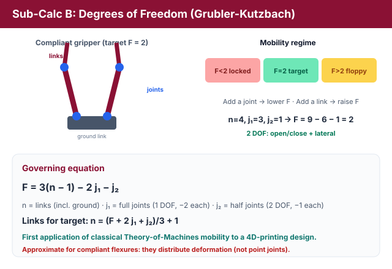
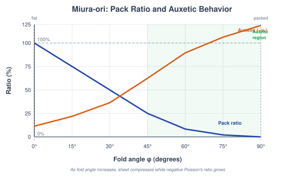
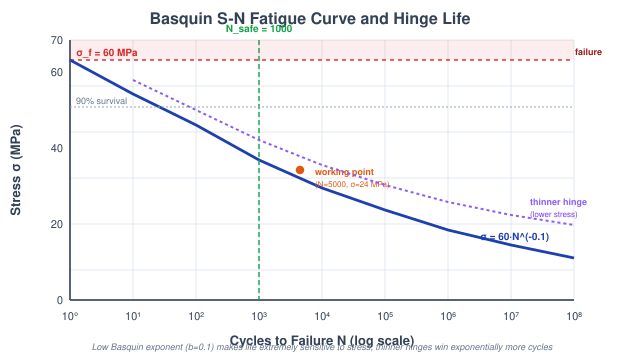

# Theory: Multi-Material 4D Structure Design & Self-Folding Flat-Pack Structures

## 1. Introduction to 4D Structure Design
4D printing lets you make a flat, cheap-to-fabricate sheet that later folds itself into a functional 3D shape when a stimulus arrives. The "fourth dimension" is the programmed transformation over time. What makes it work isn't one clever material but the *contrast* between materials: stiff panels that stay flat and soft printed hinges that do all the bending. Get the geometry and the material contrast right and the sheet snaps into the shape you intended, whether a box, a gripper, or a deployable panel, with no external assembly.

---

## 2. From Flat Sheet to Folded Device
Every structure in this experiment is a set of rigid panels joined by compliant hinges. Five questions decide whether the fold behaves:
1. **Will the fold stay crisp?** The hinge must be far softer than the panels so the bending localises (Sub-Calc A).
2. **Does the mechanism have the right joints?** Too few and it jams; too many and it flops (Sub-Calc B).
3. **What fold angles reach the target?** Serial-chain kinematics, forward and inverse (Sub-Calc C).
4. **How small does it pack?** Rigid-origami tessellation and auxetic deployment (Sub-Calc D).
5. **How long does the hinge last?** Cyclic fatigue of the flexure (Sub-Calc E).

---

## 3. Stiffness Contrast and the Self-Folding Box (Sub-Calc A)
A living hinge folds cleanly only if it's soft enough relative to the panels it connects. Panel bending stiffness scales with the cube of thickness through the second moment of area:

EI = E&middot;b&middot;h3/12

with panel width b = 10 mm. The controlling quantity is the **stiffness contrast** between the passive panel and the active hinge material:

SC = Epassive / Eactive

Treating the hinge as a short beam under a representative actuation moment M = 0.12 N&middot;mm, the rotation is &theta; = M&middot;Lhinge/(EaI), so the printed hinge length required to reach a fold angle &theta; is:

Lhinge = &theta;&middot;Ea&middot;I / M &nbsp;&nbsp; (&theta; in radians)

How much of the rotation actually stays in the hinge rather than smearing into the panels follows a localisation fraction with a geometric ratio Rgeom = 100:

fhinge = SC / (SC + 100)

The hinge materials span hydrogel (1 MPa), elastomer (5 MPa) and soft SMP (20 MPa); panels are PLA (2 GPa) or ABS (2.3 GPa). The rule the simulation flags is SC &ge; 1000 for a genuinely clean box. Below that the panels bow and the corners round off.

<em>Figure 1: The fraction of the fold that stays in the hinge, f = SC/(SC+100), climbs toward 100% as the panel-to-hinge stiffness contrast grows; past SC &ge; 1000 the box folds crisply (Sub-Calc A).</em>

---

## 4. Mechanism Mobility of the Self-Closing Gripper (Sub-Calc B)
A printed gripper is a planar linkage, and whether it can move at all is a counting problem. The **Kutzbach-Gr&uuml;bler criterion** gives the mobility (degrees of freedom) of a planar mechanism with n links, j1 full (one-DOF) joints and j2 half (two-DOF) joints:

F = 3(n &minus; 1) &minus; 2j1 &minus; j2

Each free link contributes three planar freedoms; every full joint removes two, every half joint removes one. The regimes matter for design: F &lt; 0 is over-constrained and jammed, F = 0 is a rigid structure, F = 1 permits a single stiff motion, **F = 2 is the sweet spot** for a controllable open/close gripper, and F &gt; 2 is under-constrained and floppy. Rearranging for the link count needed to hit a target mobility:

n = (F + 2j1 + j2)/3 + 1

<em>Figure 2: Mobility F falls by two for every full joint added; the design target is the narrow F = 2 band where the jaws open and close in a controlled way (Sub-Calc B).</em>

---

## 5. Fold Kinematics of a Serial Hinge Chain (Sub-Calc C)
A strip of rigid panels linked by hinges is a serial kinematic chain. With equal panel length L = 10 mm and hinge angles &theta;i, the tip position comes from summing the cumulative rotations, which is **forward kinematics**:

xtip = &Sigma;i Li cos(&Sigma;j&le;i &theta;j), &nbsp; ytip = &Sigma;i Li sin(&Sigma;j&le;i &theta;j)

The reverse question, what fold angles land the tip on a chosen target, is **inverse kinematics**. There's no closed form for a general chain, so the simulation uses **cyclic coordinate descent (CCD)**: sweeping from the last hinge to the first, each hinge is rotated to point the tip-to-joint vector at the target, iterating until it converges. Every hinge is clamped to &plusmn;90&deg;, and the tip counts as reaching the target once the residual error falls below 1 mm (the chain's reach is about 30 mm).

<em>Figure 3: Forward kinematics maps hinge angles to the tip position; inverse kinematics (CCD) solves the angles that fold the strip onto a target point (Sub-Calc C).</em>

---

## 6. Miura-ori Tessellation and Auxetic Deployment (Sub-Calc D)
The Miura-ori crease pattern packs flat and deploys in a single rigid motion. Its geometry is set by two angles: the crease sector angle &alpha; and the fold state &phi;. The dihedral angle of the mountain-valley folds is:

tan(&theta;M) = tan(&alpha;)&middot;sin(&phi;)

Folding contracts the pattern in both in-plane directions, a straight-fold contraction &lambda;L = cos&phi; and a zigzag contraction &lambda;W = &radic;(1 &minus; sin2&alpha;&middot;sin2&phi;), so the packed area as a fraction of the flat sheet is:

Apack/Aflat = cos&phi; &middot; &radic;(1 &minus; sin2&alpha; sin2&phi;)

The signature property is the in-plane **Poisson's ratio**, obtained from the two contractions:

&nu;x = &minus;d(ln&lambda;W)/d(ln&lambda;L) &lt; 0

Because &nu;x is negative, the sheet is **auxetic**: pull it open in one direction and it expands in the other too, which is exactly why a single actuation deploys the whole array. Deployable solar panels and self-expanding stents use this.

<em>Figure 4: As the fold angle &phi; increases the Miura sheet packs to a small fraction of its flat area while its Poisson's ratio stays negative, so it expands in both directions at once (Sub-Calc D).</em>

---

## 7. Living-Hinge Cycle Life and Basquin's Law (Sub-Calc E)
Every open/close cycle bends the living hinge, and repeated bending eventually cracks it by fatigue. Folding a hinge of length L through angle &theta; sets the bend radius R = L/&theta;, and the peak surface (skin) strain of a beam bent to that radius is:

R = L/&theta;, &nbsp; &epsilon;max = h/(2R)

With an effective hinge modulus Eeff = 400 MPa near actuation, the peak cyclic stress is &sigma;max = Eeff&middot;&epsilon;max. The number of cycles the hinge survives follows **Basquin's power law** (the S-N curve), inverted for life:

&sigma; = &sigma;f&middot;N&minus;b &rArr; N = (&sigma;f/&sigma;max)1/b

using fatigue strength coefficient &sigma;f = 60 MPa and Basquin exponent b = 0.1. If the per-cycle stress already meets or exceeds &sigma;f the hinge fails almost immediately (N drops to ~0.5). A polymer safety factor of 5 gives the dependable life Nsafe = N/5, and the model calls a hinge long-lived when Nsafe &ge; 1000. Since b is small, the life depends steeply on stress: halving the thickness cuts the strain and buys exponentially more cycles.

<em>Figure 5: The Basquin S-N curve &sigma; = &sigma;fN&minus;b sets how many open/close cycles the hinge survives; a thinner hinge lowers the per-cycle stress and moves it far to the right (Sub-Calc E).</em>

---

## 8. Folding as a Timed, Multi-Material, Finite-Life Mechanism

Three things must line up for a flat sheet to become a shape. First, **mobility** F = 3(n &minus; 1)
&minus; 2j1 &minus; j2 decides whether it *can* fold at all or is a locked structure.
Second, the fold **kinematics** trace the tip through the joint angles as the actuation runs; the fold is
a schedule in time, not an instant, and a Miura pattern collapses that schedule onto a single degree of
freedom. Time is the fourth dimension of the deployment.

**The material map is the program.** In a multi-material 4D print the fold angle and *sequence* are written
by the voxel layout: stiff passive regions versus active hinges, with stiffness contrast SC =
Epassive/Eactive. The print-head's material assignment, voxel by voxel, encodes the
target shape; there's no separate actuator.

design passes only if  F &ge; 1 (a mechanism, not a structure)  AND  hinge stress gives the required cycle life

**Cycling.** Living hinges die by fatigue on Basquin's law &sigma; = &sigma;fN&minus;b:
a thinner hinge lowers per-cycle stress and pushes survival far to the right.

**Bench bridge.** The mobility count is the Kinematics of Machinery *degrees-of-freedom* experiment
(Kutzbach-Grubler); the mapped page is in `screenshots_references/`.
