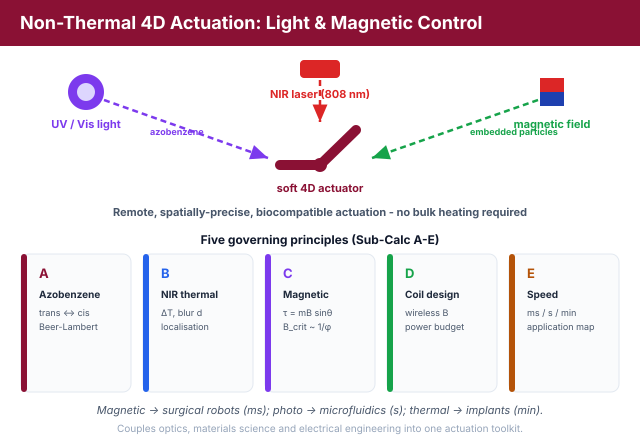
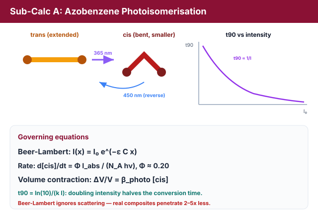
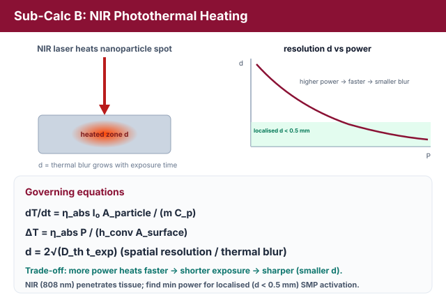
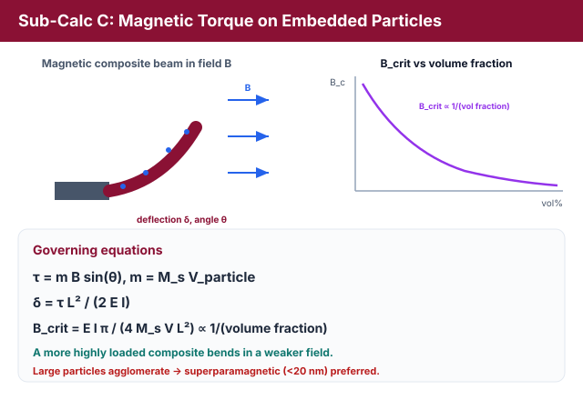
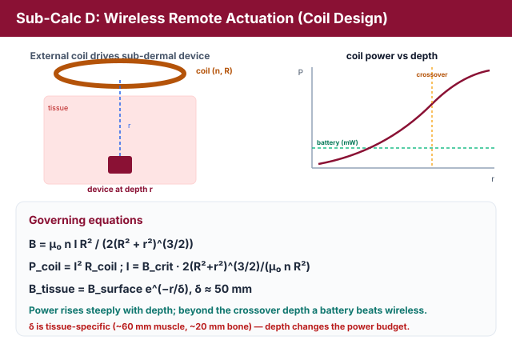
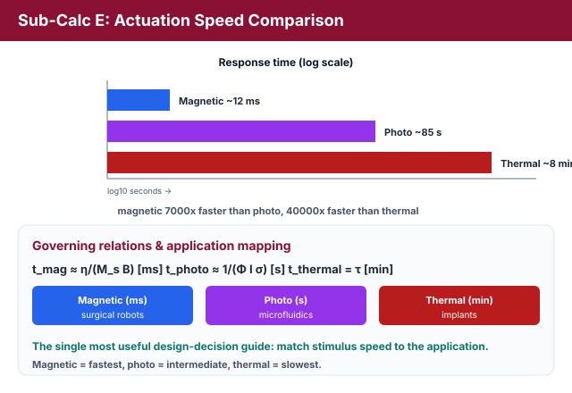
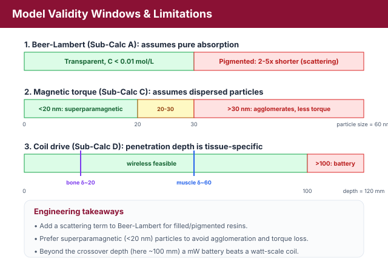

# Theory: Non-Thermal 4D Actuation - Light & Magnetic Control

## 1. Beyond Heat: Remote, Precise, Biocompatible Actuation
Thermal actuation is the most common 4D-printing stimulus, but many applications need actuation that is **remote**, **spatially precise**, or **biocompatible** in ways heat cannot provide. This experiment quantifies light-driven and magnetically-controlled actuation, connecting optics, materials science, and electronics.

<em>Figure 1: Three remote stimuli - UV/Vis light, an NIR laser and a magnetic field - actuate one structure, with response times spanning milliseconds to minutes.</em>

---

## 2. Azobenzene Photoisomerisation: trans -> cis - The Light-Driven Actuator Strip (Sub-Calc A)
Azobenzene (AZO) molecules switch between an extended **trans** and a bent **cis** form under light. UV light (365 nm) drives trans -> cis; visible light (450 nm) reverses it. The light intensity decays with depth x according to the **Beer-Lambert law**:

I(x) = I0 &middot; e&minus;&epsilon;&middot;C&middot;x

where &epsilon; is the molar absorptivity and C is the AZO concentration. The **photoisomerisation rate** is set by the absorbed photon flux:

d[cis]/dt = &Phi; &middot; Iabs / (NA &middot; h&nu;)

with quantum yield &Phi; &asymp; 0.20 for AZO and photon energy h&nu;. Integrating gives a first-order approach to the photostationary state, [cis](t) = [cis]pss(1 &minus; e&minus;k&middot;I&middot;t), so the time to reach a given conversion is **inversely proportional to intensity**:

t90 = ln(10) / (k &middot; I)

Doubling the intensity halves the conversion time. The bent cis isomer occupies less volume, producing a **photo-induced volume contraction**:

&Delta;V/V = &beta;photo &middot; [cis]

<em>Figure 2: UV light drives the extended trans isomer to the bent cis form (visible light reverses it); the volume change produces a heat-free, reversible photomechanical response.</em>

This is the fundamental light-driven shape-change mechanism, and because the trans <-> cis switch needs no heat, it enables fast, reversible, room-temperature actuation.

---

## 3. NIR Photothermal Actuation - The NIR Skin-Activated Implant (Sub-Calc B)
Near-infrared (NIR, ~808 nm) light penetrates tissue far better than UV. Embedded NIR-absorbing nanoparticles (e.g. gold nanorods) convert the light to heat, locally triggering a shape-memory transition. The local **heating rate** is:

dT/dt = &eta;abs &middot; I0 &middot; Aparticle / (m &middot; Cp)

and the **steady-state temperature rise** balances absorbed power against convective loss:

&Delta;T = &eta;abs &middot; Plaser / (hconv &middot; Asurface)

Heat then diffuses sideways, blurring the activated region. The **spatial resolution** (thermal blur) grows with exposure time:

d = 2&middot;&radic;(Dth &middot; texp)

<em>Figure 3: NIR-absorbing nanoparticles convert light to heat at a spot; higher power reaches the activation temperature faster, shrinking the thermal-blur radius d.</em>

There is a clear **trade-off**: higher laser power heats the spot to the activation temperature faster, so a shorter exposure is needed and the thermal blur d is smaller. To achieve localised activation (d &lt; 0.5 mm) the laser power must exceed a minimum value, while &Delta;T must still clear the SMP activation threshold (&Delta;Trequired &asymp; 25&deg;C from Experiment 1).

---

## 4. Magnetic Torque on Embedded Particles - The Magnetic Catheter Tip / Micro-Gripper (Sub-Calc C)
A composite filled with magnetic particles (Fe3O4 or NdFeB) responds to an external field, enabling **wireless** actuation. A particle of magnetic moment m in a field B feels a **torque**:

&tau; = m &middot; B &middot; sin(&theta;) , &nbsp; m = Ms &middot; Vparticle

This torque bends a magnetic-composite beam. For small angles the tip **deflection** is:

&delta; = &tau; &middot; L&sup2; / (2 &middot; E &middot; I)

The **critical field** to bend the beam through 45&deg; follows from setting the magnetic moment against the elastic restoring moment:

Bcrit = E &middot; I &middot; &pi; / (4 &middot; Ms &middot; V &middot; L&sup2;)

<em>Figure 4: An external field torques the embedded dipoles and bends the composite beam in milliseconds; the critical field falls as the particle volume fraction rises.</em>

Because the effective magnetisation scales with particle volume fraction, **Bcrit scales inversely with the particle volume fraction**: a more highly loaded composite bends in a weaker field.

---

## 5. Wireless Remote Actuation: Coil Design - The Wireless Coil Driving an In-Body Robot (Sub-Calc D)
To actuate a sub-dermal device, an external coil must produce Bcrit at a target depth. The on-axis field of a coil of n turns, radius R, carrying current I, at distance r is:

B = &mu;0 &middot; n &middot; I &middot; R&sup2; / (2(R&sup2; + r&sup2;)3/2)

Inverting for the current needed to reach Bcrit and using P = I&sup2;Rcoil gives the **power budget**:

I = Bcrit &middot; 2(R&sup2;+r&sup2;)3/2 / (&mu;0 n R&sup2;) , &nbsp; Pcoil = I&sup2; Rcoil

<em>Figure 5: An external coil must deliver Bcrit at the implant depth; the required current and power climb steeply with depth, while tissue further attenuates the field.</em>

The field is further attenuated through tissue, Btissue = Bsurface&middot;e&minus;r/&delta; with &delta; &asymp; 50 mm. Because the required power rises steeply with depth, beyond a **crossover depth** a battery-powered implant (milliwatts) becomes more practical than wireless coil drive (watts).

---

## 6. Actuation Speed Comparison - Pick the Right Trigger for the Job (Sub-Calc E)
The three stimuli differ by orders of magnitude in response time:

tmag &asymp; &eta;medium/(MsB) [ms] &nbsp;&laquo;&nbsp; tphoto &asymp; 1/(&Phi; I &sigma;abs) [s] &nbsp;&laquo;&nbsp; tthermal [min]

<em>Figure 6: The three stimuli differ by orders of magnitude in response time, which maps each to its niche: magnetic to surgical robots, photo to microfluidics, thermal to implants.</em>

Magnetic actuation is the **fastest** (milliseconds), photo is **intermediate** (seconds), and thermal is the **slowest** (minutes). This maps each stimulus to its natural application: **magnetic -> surgical robots**, **photo -> microfluidics**, **thermal -> implants**. This comparison table is the single most useful design-decision guide in the experiment.

---

## 7. Contradictions and Limitations

<em>Figure 7: Validity windows - Beer-Lambert without scattering, dispersed vs agglomerated particles, and tissue-specific penetration depth.</em>

**Contradiction 1 - Beer-Lambert ignores scattering.** Sub-Calc A uses the Beer-Lambert law, which assumes a purely **absorbing** medium. Real 4D-printed composites contain particles and pigments that **scatter** light, so the actual penetration depth is 2-5x shorter than predicted in heavily pigmented resins. Beer-Lambert is accurate only for transparent resins with low AZO loading (C &lt; 0.01 mol/L); filled composites need a modified law with a scattering term.

**Contradiction 2 - magnetic particle agglomeration.** Sub-Calc C assumes uniformly dispersed, non-interacting particles. In reality, ferromagnetic particles (Fe3O4 &gt; 30 nm) **agglomerate** through dipole-dipole interactions, forming clusters with larger effective volume but lower surface area, which rotate less freely in a viscous matrix and so deliver less torque per gram. This is why **superparamagnetic** nanoparticles (&lt; 20 nm) - which do not agglomerate below their blocking temperature - are universally preferred.

**Contradiction 3 - tissue penetration depth is tissue-specific.** Sub-Calc D uses &delta; &asymp; 50 mm, but the electromagnetic penetration depth is frequency- and tissue-dependent (at 50 Hz, &delta; &asymp; 60 mm in muscle but only ~20 mm in bone). For deep implants (&gt; 100 mm) the required coil power rises dramatically, so the student must identify the **crossover depth** beyond which a battery-powered implant is the better choice.

---

## 8. Relevance
Non-thermal actuation is the research frontier of 4D printing. The wireless coil design uniquely links materials science to electrical circuit design, the nanoparticle-agglomeration effect explains why superparamagnetic particles dominate, and the actuation-speed comparison is the most practically useful single output of the entire lab set.
