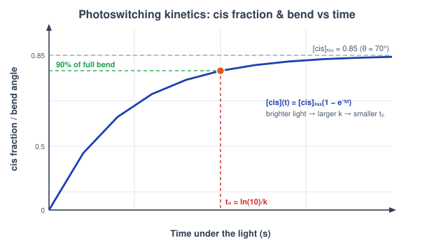
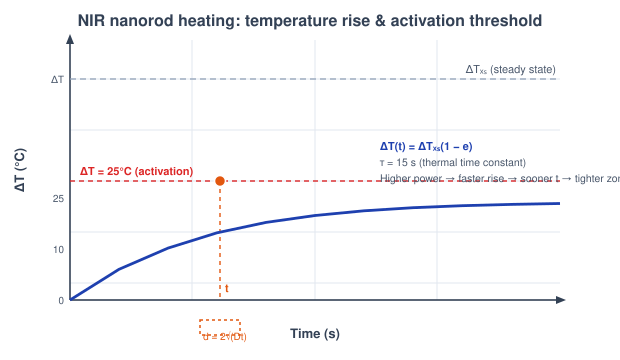
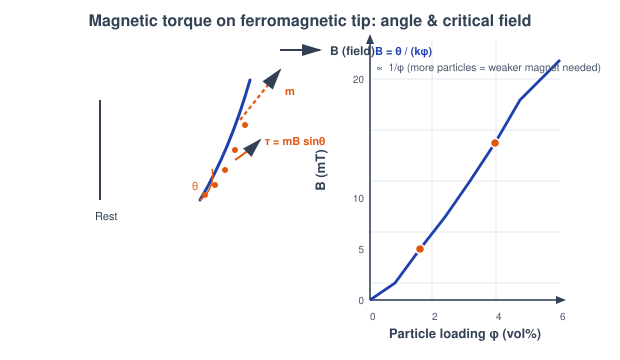
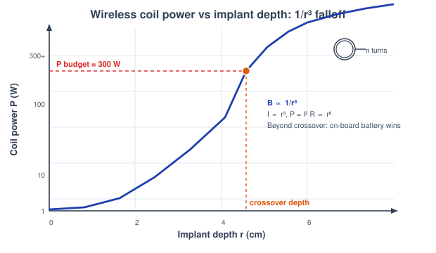

# Theory: Non-Thermal 4D Actuation

## 1. Introduction to Non-Thermal 4D Printing
4D printing adds a time axis to additive manufacturing: a printed structure changes its shape or function after fabrication in response to an external stimulus. The most familiar route is thermal — heat a shape-memory polymer through its glass transition. But bulk heating is slow, hard to localise, and awkward inside the body. This experiment covers the *non-thermal* alternatives, where light and magnetic fields do the driving. Each brings its own physics and its own trade-offs: light can be aimed precisely but is limited by absorption and reaction kinetics, magnetic fields pass through tissue almost untouched and act nearly instantly, and near-infrared light splits the difference by converting to local heat only where nanoparticles absorb it.

---

## 2. Stimuli, Kinetics, and Confinement
Three ideas recur across the sub-calcs. First, **how far** a structure moves is set by an equilibrium — a photostationary state, a magnetic torque balance, or a steady temperature rise. Second, **how fast** it gets there is set by a kinetic time constant — a first-order rate, a viscous alignment time, or a thermal relaxation time. Third, **how local** the effect stays matters as much as its size: a heated zone that spreads beyond its target, or a coil field that demands runaway power at depth, defeats the purpose. The five sub-calcs each isolate one stimulus and quantify its equilibrium, its kinetics, and its practical limit.

---

## 3. The Light-Driven Actuator Strip (Sub-Calc A)
An azobenzene dye printed into one layer of a bilayer strip isomerises from its extended *trans* form to its bent *cis* form under 365 nm UV light, contracting that layer and bending the strip toward the lamp. 450 nm visible light drives it back. How much light the dye actually captures follows the **Beer-Lambert law** through an optical depth &epsilon;Cx:

Iabs = I0 (1 - e-&epsilon;Cx)

with molar absorptivity &epsilon; = 1250, path length x = 0.1 cm, and dye loading C in mmol/L. The dye then approaches its **photostationary state (PSS)** by first-order photokinetics:

[cis](t) = [cis]PSS (1 - e-kt) &nbsp;&nbsp; k = k0 I0 (fabs(C) / fabs(8))

where [cis]PSS = 0.85 under 365 nm and 0.12 under 450 nm, fabs is the absorbed fraction, and k0 = 2.709&times;10-3. The actuation time — reaching 90% of full switching — and the bend angle are:

t90 = ln(10) / k &nbsp;(&prop; 1/I0) &nbsp;&nbsp;|&nbsp;&nbsp; &theta; &asymp; 70&deg; &middot; ([cis] / 0.85)

Brighter light bends the strip faster; the bend saturates at about 70&deg; at full cis loading.

<em>Figure 1: Under UV the cis fraction climbs first-order toward its PSS value and the strip bends with it; t90 = ln(10)/k marks when it reaches 90% of full bend, and it shrinks as brightness rises (Sub-Calc A).</em>

---

## 4. The NIR Skin-Activated Implant (Sub-Calc B)
Gold nanorods tuned to 808 nm absorb near-infrared light — a wavelength that passes through skin with little attenuation — and convert it to local heat, switching a thermoresponsive implant on without wires or surgery. The steady temperature rise scales with laser power P and nanorod loading, and heating follows a **Newtonian (lumped-capacitance) approach** to that steady state:

&Delta;Tss = 560 &middot; P &middot; load &nbsp;&nbsp;|&nbsp;&nbsp; &Delta;T(t) = &Delta;Tss (1 - e-t/&tau;H)

with thermal time constant &tau;H = 15 s. The implant switches on once the rise clears the activation threshold &Delta;Treq = 25 &deg;C, giving an activation time:

tact = -&tau;H ln(1 - &Delta;Treq / &Delta;Tss) &nbsp;&nbsp; (only if &Delta;Tss &gt; &Delta;Treq)

Heat also spreads while it activates. Treating conduction as diffusion with diffusivity Dth = 5.3&times;10-3 mm&sup2;/s, the heated-zone size at activation is:

d = 2 &radic;(Dth tact)

The design tension is real: too little power never crosses +25 &deg;C, but slow heating lets the zone diffuse wide. Because faster heating reaches threshold sooner, more power actually gives a *tighter* spot — the sub-calc reports the minimum power Pmin that keeps d below 0.5 mm.

<em>Figure 2: The nanorod spot heats toward &Delta;Tss; activation occurs where the curve crosses +25 &deg;C, and the heated-zone size d = 2&radic;(Dthtact) sets whether the trigger stays local (Sub-Calc B).</em>

---

## 5. The Magnetic Micro-Gripper / Catheter Tip (Sub-Calc C)
Ferromagnetic particles printed into a soft tip carry a net moment m that an external field B tries to align, producing a **magnetic torque** that bends the tip:

&tau; = m &times; B = m B sin&theta; &nbsp;&nbsp; m = Ms Vparticle

with saturation magnetisation Ms = 4.8&times;105 A/m (magnetite, Fe3O4) and effective moment density Meff = Ms&phi;/100 for a volume fraction &phi; in vol%. In the linear regime the tip angle grows with both loading and field, and the arc deflection of a beam of length L follows from that angle:

&theta; = min(90&deg;, km &phi; B) &nbsp;&nbsp;|&nbsp;&nbsp; &delta; = L (1 - cos&theta;) / &theta;

with km = 0.18 deg/(vol%&middot;mT) and L = 10 mm. The field needed to reach a target angle is the **critical field**, which falls inversely with particle content:

Bcrit = &theta;target / (km &phi;) &nbsp;&nbsp; (&prop; 1/&phi;)

So printing in more particles lets a gentler, safer external magnet do the steering — and because the torque is magnetic, it acts in milliseconds and passes straight through tissue.

<em>Figure 3: The field-aligned moment m generates a torque &tau; = mB&nbsp;sin&theta; that curls the tip; the field to steer a set angle scales as Bcrit &prop; 1/&phi;, so heavier particle loading needs a weaker magnet (Sub-Calc C).</em>

---

## 6. The Wireless Coil Driving an In-Body Robot (Sub-Calc D)
An external drive coil must deliver a working field to a device implanted at depth r. The **on-axis field** of a coil of n turns and radius R carrying current I is:

B = &mu;0 n I R&sup2; / [2 (R&sup2; + r&sup2;)3/2]

Far from the coil this falls off as 1/r&sup3;. Crucially, biological tissue has relative magnetic permeability &approx; 1, so unlike light or RF power it does *not* absorb a magnetostatic field — the field reaching the device equals the coil's geometric field, with no extra exponential decay. Inverting for the current needed to reach the working field Bcrit = 50 mT, and the resistive power that current dissipates in the winding:

Ireq = Bcrit &middot; 2 (R&sup2; + r&sup2;)3/2 / (&mu;0 n R&sup2;) &nbsp;&nbsp;|&nbsp;&nbsp; P = Ireq2 Rcoil, &nbsp; Rcoil &prop; n

Because the required field is fixed but the geometric coupling collapses with depth, the coil power climbs steeply. Past the **crossover depth**, where P exceeds a practical wireless budget of 300 W, a milliwatt-scale on-board battery becomes the sensible choice.

<em>Figure 4: The on-axis field falls as 1/r&sup3; through magnetically-transparent tissue, so the current and power to hold Bcrit rise sharply with depth; beyond the crossover the coil exceeds the 300 W budget and a battery wins (Sub-Calc D).</em>

---

## 7. Picking the Right Trigger (Sub-Calc E)
The three stimuli live in completely different time regimes, each set by its own rate-limiting physics. Magnetic alignment is viscosity-limited, photoswitching is reaction-kinetics-limited, and thermal actuation is diffusion-limited:

tmag &asymp; &eta; / (Ms B) = 0.6 / B &nbsp;|&nbsp; tphoto &asymp; 1 / (&Phi; I &sigma;) = 850 / I &nbsp;|&nbsp; ttherm = &tau;thermal

(B in mT, I in mW/cm&sup2;, times in seconds). Across typical settings the magnetic strip snaps in milliseconds, the light-driven strip in seconds, and the heat-driven strip in minutes — spanning roughly six decades. The two ratios tphoto/tmag and ttherm/tmag quantify the gap. There is no single best trigger; the right one is the one whose speed matches the job — magnetic for fast surgical micro-robots, light for precisely-addressed microfluidics, and heat for simple, slow implants.

<em>Figure 5: On a log time axis the three triggers separate cleanly — magnetic (ms), photo (s), thermal (min) — and each maps to the application whose required response speed it fits (Sub-Calc E).</em>

