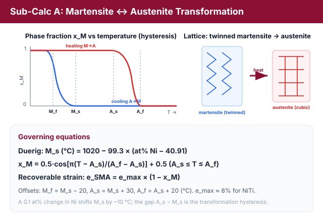
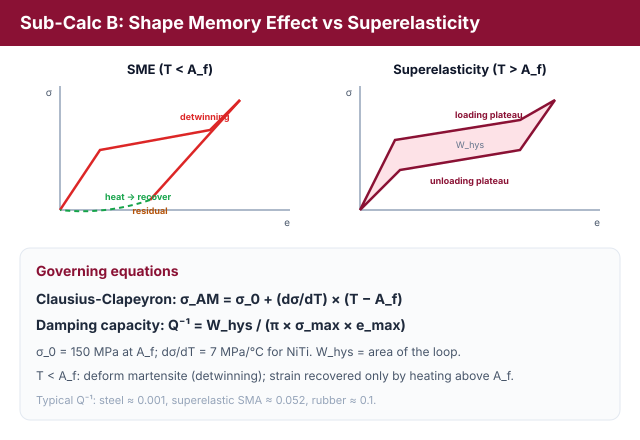
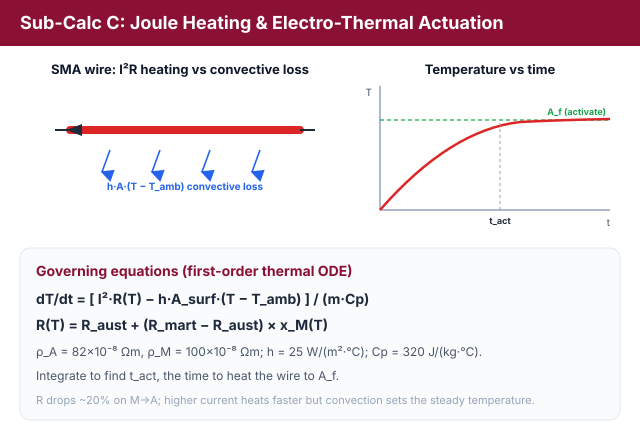
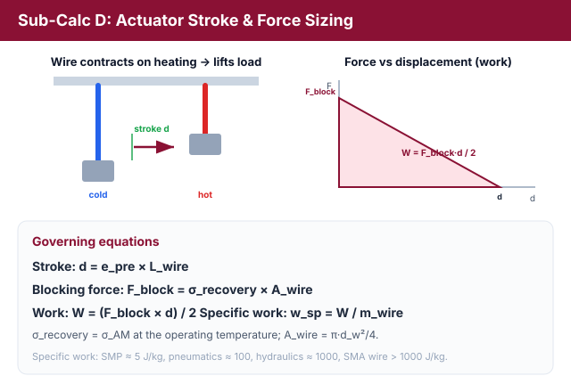
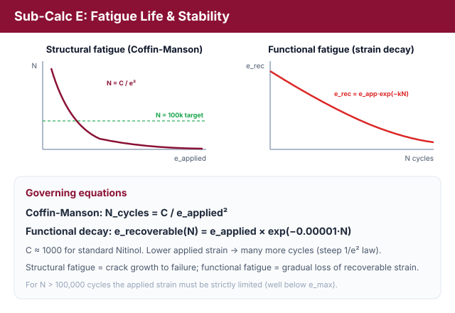

# Theory: Shape Memory Alloys (SMAs) & Nitinol Actuator Design

Shape Memory Alloys (SMAs), particularly Nitinol (Ni-Ti), are active materials capable of undergoing large reversible deformations. They are widely used in biomedical stents, aerospace morphing structures, and robotic actuators. This behavior is driven by a reversible solid-state phase transformation between a high-temperature parent phase (Austenite) and a low-temperature product phase (Martensite).

---

## 1. Martensite Phase Transformation (Sub-Calc A)

Nitinol transformation temperatures depend strongly on composition. A variation of just 0.1 at% in Nickel content can shift the transformation start temperature by about 10°C.
The Martensite Start temperature (M_s) can be estimated using the **Duerig Empirical Formula**:

M_s (°C) = 1020 - 99.3 × (at% Ni - 40.91)

Other transformation boundaries are related to M_s by characteristic offsets:
* **M_f (Martensite Finish):** M_f = M_s - 20°C
* **A_s (Austenite Start):** A_s = M_s + 30°C
* **A_f (Austenite Finish):** A_f = A_s + 20°C

During heating, the Martensite phase fraction (x_M) transforms to Austenite according to a cosine kinetics profile:

x_M = 0.5 × cos[π × (T - A_s) / (A_f - A_s)] + 0.5 &nbsp;&nbsp;&nbsp;&nbsp; for A_s ≤ T ≤ A_f

Where:
* x_M = 1.0 for T < A_s
* x_M = 0.0 for T > A_f

The recoverable shape memory strain (e_SMA) corresponds to the fraction of transformed martensite:

e_SMA = e_max × (1 - x_M)

where e_max is the maximum lattice recovery strain (8% for NiTi).

<em>Figure 1: NiTi transforms between a low-temperature martensite and a high-temperature austenite; the heating (M&#8594;A) and cooling (A&#8594;M) branches form a hysteresis loop set by M_f, M_s, A_s, A_f, and the recoverable strain follows e_SMA = e_max(1 &#8722; x_M) (Sub-Calc A).</em>

---

## 2. Stress-Strain Behavior: SME vs Superelasticity (Sub-Calc B)

Operating temperatures relative to the Austenite Finish temperature (A_f) define the mechanical response:
* **T < A_f: Shape Memory Effect (SME).** Deforming the low-temperature martensite phase results in detwinning (apparent plastic strain). This strain (permanent set) is stable after unloading, but is completely recovered by heating the material above A_f to transform it back to austenite.
* **T > A_f: Superelasticity (SE).** Deforming the high-temperature austenite phase triggers stress-induced martensite (SIM) transformation. Unloading releases this unstable martensite, allowing the material to return completely to its original shape, forming a closed superelastic hysteresis loop.

The superelastic plateau stress (σ_AM) rises linearly with temperature above A_f according to the **Clausius-Clapeyron relation**:

σ_AM = σ_0 + (dσ/dT) × (T - A_f)

Where:
* σ_0 = 150 MPa (base plateau stress at A_f).
* dσ/dT = 7 MPa/°C (stress-temperature phase boundary slope for NiTi).

The energy dissipated per volume during a full cycle is the area enclosed by the hysteresis loop:

W_hysteresis = ∫ σ de

The damping capacity (Q-1) is evaluated as:

Q-1 = W_hysteresis / (π × σ_max × e_max)

Typical values: structural steel (Q-1 ≈ 0.001), superelastic SMA (Q-1 ≈ 0.052), and rubber (Q-1 ≈ 0.1).

<em>Figure 2: Below A_f the alloy shows the shape-memory effect (residual strain recovered on heating); above A_f it is superelastic, tracing a closed stress-strain loop whose enclosed area is the dissipated energy W_hys (Sub-Calc B).</em>

---

## 3. Joule Heating & Electro-Thermal Actuation (Sub-Calc C)

Actuation is commonly triggered by electrical current. Joule heating generates heat, while convection cools the wire. The time-varying temperature (T) is described by a first-order thermal ODE:

dT/dt = [ I² × R(T) - h × A_surface × (T - T_amb) ] / (m × Cp)

Where:
* **Current (I):** Applied electrical input.
* **Resistance (R):** Temperature-dependent electrical resistance. R(T) drops by ~20% during transition from Martensite to Austenite:
  
R(T) = R_austenite + (R_martensite - R_austenite) × x_M(T)

  where R_austenite = ρ_A × L / A_wire and R_martensite = ρ_M × L / A_wire.
* **Resistivity (ρ):** ρ_A = 82 × 10-8 Ω·m, ρ_M = 100 × 10-8 Ω·m.
* **Surface Area (A_surface):** π × d_w × L.
* **Cross-Section Area (A_wire):** π × d_w² / 4.
* **Convective Coefficient (h):** 25 W/(m²·°C).
* **Specific Heat (Cp):** 320 J/(kg·°C).
* **Mass (m):** ρ_density × A_wire × L (density ρ_density = 6450 kg/m³).

Integrating this ODE yields the activation time (t_act) required to heat the wire to A_f.

<em>Figure 3: Passing a current Joule-heats the wire while convection cools it; solving the first-order thermal ODE gives the temperature rise and the activation time t_act needed to reach A_f (Sub-Calc C).</em>

---

## 4. Actuator Stroke & Force Sizing (Sub-Calc D)

To size an SMA wire for a robotic gripper or actuator:
* **Stroke (d):** Linear contraction displacement:
  
d = e_pre × L_wire

  where e_pre is the applied pre-strain.
* **Blocking Force (F_block):** The maximum force developed by the wire when fully constrained:
  
F_block = σ_recovery × A_wire

  where σ_recovery = σ_AM at operating temperature.
* **Work Output (W):** Assuming a linear spring retraction:
  
W = (F_block × d) / 2 &nbsp;&nbsp;&nbsp;&nbsp; (Joules)

* **Specific Work (w_sp):**
  
w_sp = W / m_wire &nbsp;&nbsp;&nbsp;&nbsp; (J/kg)

Comparison: SMP actuators (5 J/kg), pneumatics (100 J/kg), hydraulics (1000 J/kg), and SMA wires (>1000 J/kg).

<em>Figure 4: On heating the wire contracts by a stroke d and can lift a load; the blocking force F_block and the force-displacement work W size the actuator and set its specific work (Sub-Calc D).</em>

---

## 5. Fatigue Life & Stability (Sub-Calc E)

Repeated thermomechanical cycles lead to functional degradation and structural fatigue.
The structural fatigue life (N_cycles) is governed by the **Coffin-Manson Fatigue Law**:

N_cycles = C / e_applied²

where C = 1000 for standard Nitinol.
Functional fatigue results in a gradual loss of recoverable strain due to accumulated dislocation networks:

e_recoverable(N) = e_applied × exp(-0.00001 × N)

For a target fatigue life of N > 100,000 cycles, the applied strain must be strictly limited.

<em>Figure 5: Structural fatigue life falls steeply as 1/e&#178; (Coffin-Manson), while functional fatigue slowly erodes the recoverable strain with cycle count - both push the design toward a low applied strain (Sub-Calc E).</em>

