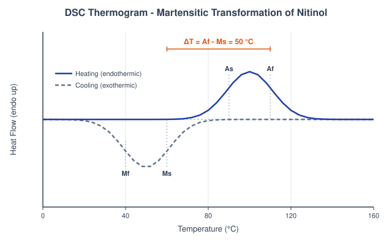
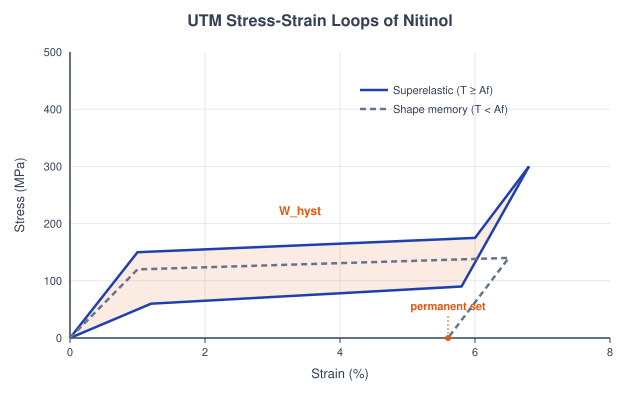

# Theory: Shape Memory Alloys and their Laboratory Characterisation

## 1. Introduction to Shape Memory Alloys in 4D Printing
4D printing adds time as the fourth dimension: a printed part reconfigures its shape or function after fabrication when it meets an external stimulus. Where thermal polymers rely on a soft glass transition, the metallic route uses a **Shape Memory Alloy (SMA)**, most often near-equiatomic Nitinol (NiTi). An SMA remembers a hot "austenite" shape, can be deformed while cold, and snaps back on heating through a solid-state phase change. That gives large recoverable strains (up to ~8 %) and stresses of several hundred MPa, which is why NiTi shows up in 4D actuators, stents, and morphing structures.

---

## 2. The Martensitic Transformation
The behaviour rests on a diffusionless, reversible transformation between two crystal structures:
1. **Austenite (B2):** the high-temperature, high-symmetry parent phase, stiff and holding the "remembered" geometry.
2. **Martensite (B19'):** the low-temperature monoclinic phase, soft and easily reoriented (detwinned) by stress.

Four temperatures bound the hysteresis loop: on cooling, martensite forms between Ms (start) and Mf (finish); on heating, austenite grows between As (start) and Af (finish). The forward and reverse paths don't coincide, so there's a thermal hysteresis that the DSC station measures directly. The rest of this page follows the five lab instruments that put numbers on each part of this transformation.

---

## 3. Transformation Thermometry - DSC Machine (Sub-Calc A)
Differential Scanning Calorimetry ramps a milligram of Nitinol and records heat flow; the endothermic (heating) and exothermic (cooling) peaks locate the transformation temperatures. Composition sets Ms through the **Duerig empirical relation**, and the remaining temperatures follow the fixed offsets used in the simulation:

Ms = 1020 &minus; 99.3 &times; (at%Ni &minus; 40.91)

Mf = Ms &minus; 20 &nbsp;&nbsp; As = Ms + 30 &nbsp;&nbsp; Af = As + 20

The fraction of martensite still present at temperature T during heating follows a **cosine kinetics law**:

xM = 0.5 &times; cos[&pi;(T &minus; As) / (Af &minus; As)] + 0.5 &nbsp;&nbsp; for As &le; T &le; Af

with xM = 1 below As and xM = 0 above Af. The austenite fraction is xA = 1 &minus; xM, and the recoverable strain scales with it against a maximum &epsilon;max = 8 %:

&epsilon;SMA = &epsilon;max &times; xA = 8.0 &times; (1 &minus; xM) %

The thermal hysteresis reported by the instrument is simply &Delta;T = Af &minus; Ms.

<em>Figure 1: The DSC heating and cooling scans locate Ms, Mf, As, Af; the gap between the exothermic and endothermic peaks is the thermal hysteresis Af &minus; Ms (Sub-Calc A).</em>

---

## 4. Mechanical Regimes - Universal Testing Machine (Sub-Calc B)
Which stress-strain loop a Nitinol coupon traces depends on the test temperature relative to Af (fixed at 18 &deg;C in the model). Below Af the alloy shows the **Shape Memory Effect**: martensite detwins at a roughly constant critical stress and a permanent set stays after unloading, only recovered later by heating. At or above Af it turns **superelastic**: a stress-induced transformation forms martensite on loading and reverts on unloading, closing the loop.

The superelastic upper-plateau stress rises with temperature in a **Clausius-Clapeyron** fashion (slope 7 MPa/&deg;C, capped at 500 MPa):

&sigma;AM = 150 + 7 &times; (T &minus; Af) &nbsp;&nbsp; [MPa]

The detwinning plateau in the cold regime is &sigma;yield &asymp; 120 MPa. Loading is elastic (austenite EA = 40 GPa, martensite EM = 25 GPa) up to the plateau. The energy dissipated per unit volume is the enclosed loop area, and the damping capacity is that work normalised by the elastic energy:

Whyst = &Delta;&sigma;plateau &times; (&epsilon;max &minus; 1.5) / 100 &nbsp;&nbsp; [MJ/m3], &nbsp; &Delta;&sigma;plateau = 120 MPa

Q&minus;1 = Whyst / (&pi; &times; &sigma;max &times; &epsilon;max)

Nitinol's Q&minus;1 lands near 0.1, orders of magnitude above structural steel (~0.001), which is why it doubles as a mechanical damper.

<em>Figure 2: The UTM loop, a closed superelastic hysteresis above Af versus the open shape-memory loop with a permanent set below Af; the enclosed area is the dissipated work Whyst (Sub-Calc B).</em>

---

## 5. Electrical Actuation - Bench Power Supply & Thermocouple (Sub-Calc C)
A Nitinol wire is a resistive heater as well as an actuator, so a current I drives it through the transformation. The wire's resistance depends on phase (austenite resistivity &rho;A = 82&times;10&minus;8 &Omega;&middot;m drops ~20 % below martensite &rho;M = 100&times;10&minus;8 &Omega;&middot;m), blended through the same xM:

R(T) = RA + (RM &minus; RA) &times; xM, &nbsp;&nbsp; R = &rho; L / Awire

The temperature history is the **lumped electro-thermal ODE**, Joule input balanced against convective loss (h = 25 W/m2K, Cp = 320 J/kg&middot;K, &rho;NiTi = 6450 kg/m3, L = 0.1 m):

dT/dt = [ I2 R(T) &minus; h Asurf (T &minus; Tamb) ] / (m Cp)

Setting dT/dt = 0 gives the steady-state temperature, and the activation time tact is found by integrating the ODE until T reaches Af = 68 &deg;C:

Tss = Tamb + I2 RA / (h Asurf)

If Tss &le; Af the wire asymptotes below the finish temperature and never actuates. Above Tss &sim; 150 &deg;C the readout warns of oxidation and loss of trained behaviour.

<em>Figure 3: Resistive heating drives the wire temperature along an exponential approach to Tss; the activation time tact is where the curve crosses Af, and if Tss sits below Af actuation stalls (Sub-Calc C).</em>

---

## 6. Actuator Sizing - Load Cell & Ruler (Sub-Calc D)
Sizing a wire actuator turns geometry and a programmed pre-strain into a usable stroke and force. The recovered contraction is the pre-strain acting over the active length, while the blocking force is the recovery stress (&sigma;recovery = 400 MPa) over the cross-section, using the handy identity 1 MPa &times; 1 mm2 = 1 N:

dstroke = &epsilon;pre &times; Lwire &nbsp;&nbsp;&nbsp; Fblock = &sigma;recovery &times; Awire

Real actuation delivers roughly the triangular area under the force-stroke line, and dividing by the wire mass gives the mass-specific work that lets NiTi be compared to other actuators (&rho; = 6450 kg/m3):

W = (Fblock &times; dstroke) / 2 &nbsp;&nbsp;&nbsp; wsp = W / mwire &nbsp;&nbsp; [J/kg]

At a few hundred J/kg the specific work sits well above shape memory polymers (~5 J/kg) and pneumatics (~100 J/kg), which is the headline advantage of SMA actuation.

<em>Figure 4: The actuator rig converts pre-strain into a stroke d and a blocking force Fblock; the shaded triangle under the force-stroke line is the mechanical work, normalised by mass to give wsp (Sub-Calc D).</em>

---

## 7. Fatigue Life - Rotating Bending Rig (Sub-Calc E)
Cyclic loading limits every SMA device, and two distinct failure modes matter. **Structural fatigue**, crack growth to fracture, follows a Coffin-Manson power law with slope &minus;2 (constant C = 8 with strain as a fraction):

Nf = C / &epsilon;a2

Below ~4000 cycles the specimen is in the low-cycle, high-strain regime; above it, in finite-life durable service. Separately, **functional fatigue** is the gradual loss of recoverable strain from accumulated dislocations, modelled as an exponential decay with a strain-sensitive rate (k0 = 1.2&times;10&minus;6, n = 1.8) evaluated at a reference Nref = 10 000 cycles:

k = k0 &epsilon;n &nbsp;&nbsp;&nbsp; &epsilon;rec = &epsilon;applied &times; exp(&minus;k Nref)

Loss = (&epsilon;applied &minus; &epsilon;rec) / &epsilon;applied &times; 100 %

Both mechanisms sharpen with strain amplitude, so keeping the working strain modest is the central design lever for long-life SMA components.

<em>Figure 5: The rotating-bending S-N curve falls steeply with strain amplitude (N &prop; &epsilon;&minus;2); the 4000-cycle line separates low-cycle fatigue from the durable finite-life range (Sub-Calc E).</em>

---

## 8. The Transformation as a Temperature-Time Trajectory and its Fatigue Limit

The martensite fraction xM(T) is a state function of temperature, but a Joule-heated wire
doesn't jump. It sweeps from As to Af in time, driven by
dT/dt = [I&sup2;R(T) &minus; hAsurf(T &minus; Tamb)]/(mCp) toward the
steady state Tss = Tamb + I&sup2;RA/(hAsurf). Cooling resets
it. The actuation bandwidth, how fast the SMA can cycle, is set entirely by this thermal time constant,
and that is the fourth dimension of an SMA actuator.

stroke passes only if  work Fblock&middot;dstroke meets demand  AND  Tss stays below overheating

**Cycling.** Functional fatigue follows Nf = C/&epsilon;a2, and each cycle
loses a little recoverable strain, &epsilon;rec = &epsilon;applied &middot;
exp(&minus;k Nref). Pre-straining much above 4-5% drops life into the low-cycle regime, so a
durable actuator lives to the right of the ~4000-cycle knee.

**Bench bridge.** The wire resistance R = &rho;L/Awire that produces the Joule heating is
measured directly in the metre-bridge *resistance of a wire* experiment (IIT Roorkee); the mapped page
is in `screenshots_references/`.
